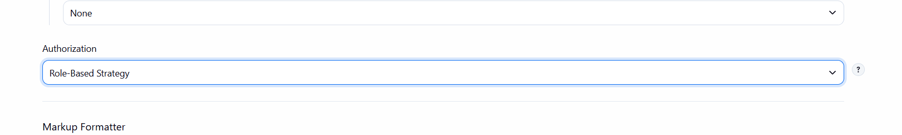
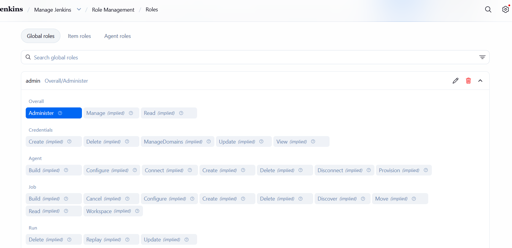
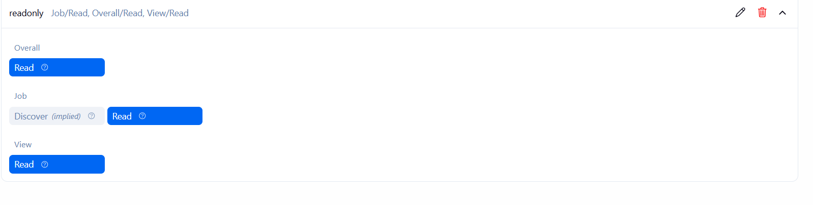
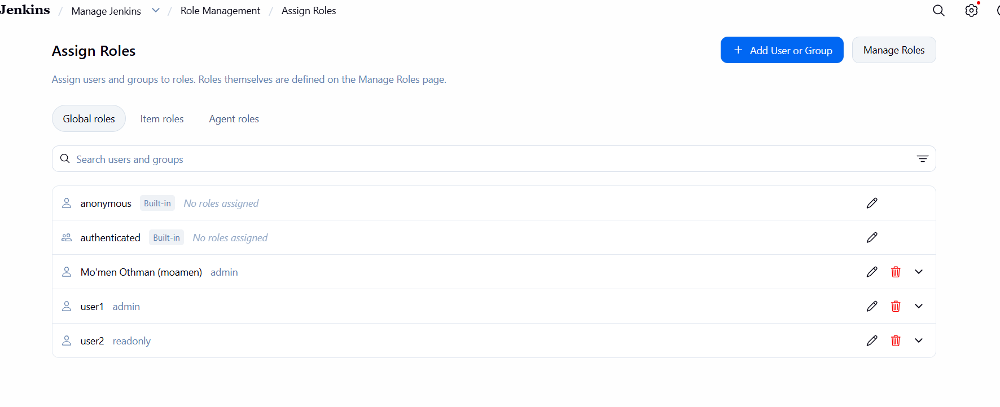

# Lab 21: Role-Based Authorization in Jenkins

## Objective

Configure Role-Based Authorization in Jenkins by creating two users with different levels of access:

- `user1` → Admin role
- `user2` → Read-only role

## Environment

- Jenkins
- Role-Based Authorization Strategy Plugin
- Ubuntu 24.04.1 LTS
- Java 21

## Implementation

### 1. Enable Role-Based Authorization

The **Role-Based Authorization Strategy** was enabled in Jenkins Global Security settings.

### 2. Create Admin Role

An `admin` role was created and assigned full administrative permissions.

### 3. Create Read-Only Role

A `readonly` role was created with permissions to view Jenkins resources without modifying them.

### 4. Assign Roles to Users

The roles were assigned to the required users:

| User | Role | Access |
|---|---|---|
| `user1` | Admin | Full administrative access |
| `user2` | Read-only | View-only access |

## Result

Role-Based Authorization was successfully configured in Jenkins.

- `user1` has administrative privileges.
- `user2` has read-only privileges.
- Different users can access Jenkins according to their assigned roles.

## Screenshots

All screenshots for this lab are available in the [`screenshots`](screenshots/) directory.
