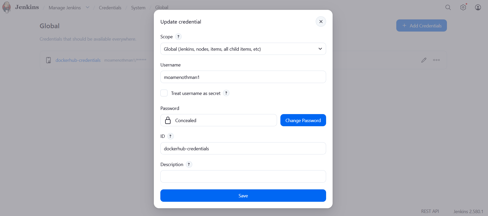
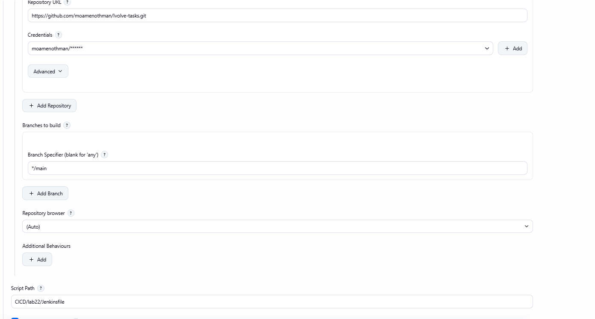
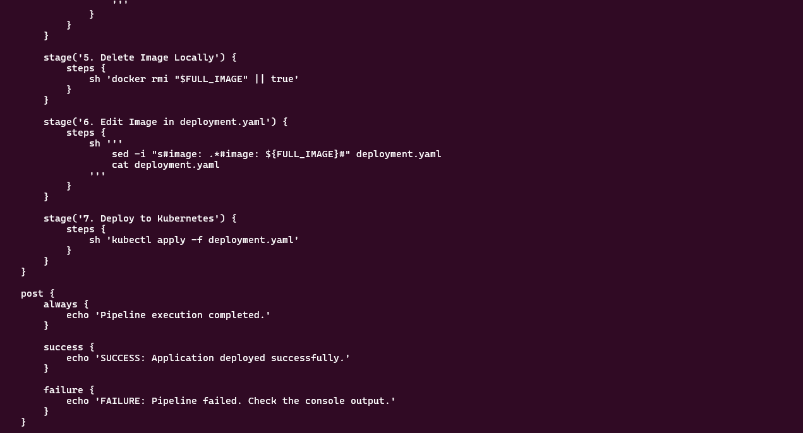
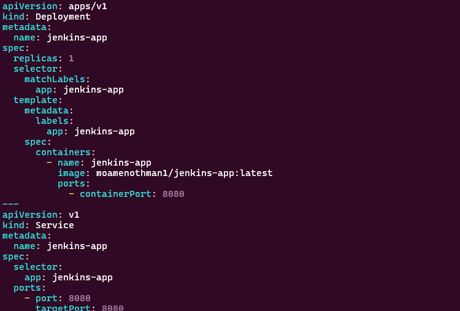
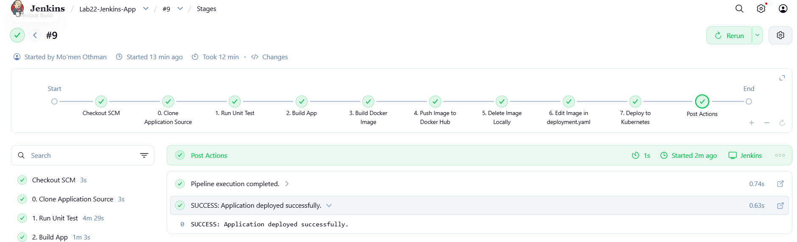
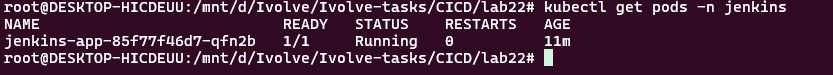

# Lab 22: Jenkins Pipeline for Application Deployment

## Overview

This lab demonstrates how to create a Jenkins CI/CD pipeline that automates the process of testing, building, containerizing, pushing, and deploying a Java application to a Kubernetes cluster.

The pipeline performs the following tasks:

1. Clone the application source code from GitHub.
2. Run unit tests.
3. Build the Java application.
4. Build a Docker image using the Dockerfile from the GitHub repository.
5. Push the Docker image to Docker Hub.
6. Delete the local Docker image.
7. Update the Kubernetes `deployment.yaml` with the new image tag.
8. Deploy the application to the Kubernetes cluster.
9. Display pipeline status using Jenkins post actions.

---

## Objectives

- Create a Jenkins Declarative Pipeline.
- Automate Maven unit testing and application building.
- Build Docker images automatically.
- Push Docker images to Docker Hub.
- Use Jenkins credentials securely.
- Dynamically update the Kubernetes deployment image.
- Deploy the application automatically to Kubernetes.
- Verify the deployed application using Kubernetes commands.

---

## Technologies Used

- Jenkins
- Git / GitHub
- Maven
- Java 17
- Docker
- Docker Hub
- Kubernetes
- Minikube
- kubectl
- Spring Boot

---

## Source Code

The application source code and Dockerfile are cloned from:

`https://github.com/Ibrahim-Adel15/Jenkins_App.git`

The application is a Spring Boot application using Maven.

Docker Hub repository:

`moamenothan1/jenkins-app`

---

## Project Structure

```text
.
├── Jenkins_App
│   ├── Dockerfile
│   ├── pom.xml
│   └── src
│       └── main
│           └── java
│               └── com
│                   └── example
│                       └── demo
│                           └── DemoApplication.java
├── Jenkinsfile
├── README.md
├── deployment.yaml
└── screenshots
    ├── create_credentials.png
    ├── deployment.png
    ├── get_pods.png
    ├── jenkinsfile.png
    ├── job_create.png
    └── pipeline_finished.png
```

---

# Jenkins Pipeline

The complete Jenkins pipeline is implemented in the `Jenkinsfile`.

```groovy
pipeline {
    agent any

    environment {
        IMAGE_NAME = 'moamenothan1/jenkins-app'
        IMAGE_TAG = "${BUILD_NUMBER}"
        FULL_IMAGE = "${IMAGE_NAME}:${IMAGE_TAG}"

        APP_DIR = 'CICD/lab22/Jenkins_App'
        DEPLOYMENT_FILE = 'CICD/lab22/deployment.yaml'
    }

    stages {

        stage('0. Clone Application Source') {
            steps {
                sh '''
                    rm -rf "$APP_DIR"
                    git clone https://github.com/Ibrahim-Adel15/Jenkins_App.git "$APP_DIR"
                '''
            }
        }

        stage('1. Run Unit Test') {
            steps {
                dir("${APP_DIR}") {
                    sh '''
                        docker run --rm \
                            -v "$PWD:/app" \
                            -w /app \
                            maven:3.9-eclipse-temurin-17 \
                            mvn test
                    '''
                }
            }
        }

        stage('2. Build App') {
            steps {
                dir("${APP_DIR}") {
                    sh '''
                        docker run --rm \
                            -v "$PWD:/app" \
                            -w /app \
                            maven:3.9-eclipse-temurin-17 \
                            mvn clean package -DskipTests
                    '''
                }
            }
        }

        stage('3. Build Docker Image') {
            steps {
                dir("${APP_DIR}") {
                    sh 'docker build -t ${FULL_IMAGE} .'
                }
            }
        }

        stage('4. Push Image to Docker Hub') {
            steps {
                withCredentials([
                    usernamePassword(
                        credentialsId: 'dockerhub-credentials',
                        usernameVariable: 'DOCKERHUB_USER',
                        passwordVariable: 'DOCKERHUB_PASS'
                    )
                ]) {
                    sh '''
                        echo "$DOCKERHUB_PASS" | docker login \
                            -u "$DOCKERHUB_USER" \
                            --password-stdin

                        docker push "$FULL_IMAGE"

                        docker logout
                    '''
                }
            }
        }

        stage('5. Delete Image Locally') {
            steps {
                sh 'docker rmi "$FULL_IMAGE" || true'
            }
        }

        stage('6. Edit Image in deployment.yaml') {
            steps {
                sh '''
                    sed -i "s#image: .*#image: ${FULL_IMAGE}#" "$DEPLOYMENT_FILE"

                    echo "Updated deployment.yaml:"
                    cat "$DEPLOYMENT_FILE"
                '''
            }
        }

        stage('7. Deploy to Kubernetes') {
            steps {
                sh '''
                    kubectl apply -f "$DEPLOYMENT_FILE"
                '''
            }
        }
    }

    post {
        always {
            echo 'Pipeline execution completed.'
        }

        success {
            echo 'SUCCESS: Application deployed successfully.'
        }

        failure {
            echo 'FAILURE: Pipeline failed. Check the console output.'
        }
    }
}
```

---

# Pipeline Stages

## 0. Clone Application Source

The pipeline removes any previous copy of the application and clones the required GitHub repository:

```bash
git clone https://github.com/Ibrahim-Adel15/Jenkins_App.git
```

This ensures that Jenkins uses the application source code and Dockerfile directly from the required GitHub repository.

---

## 1. Run Unit Test

The pipeline runs Maven tests using a Java 17 Maven Docker container:

```bash
mvn test
```

This verifies that the application passes its unit tests before continuing with the build process.

---

## 2. Build App

The application is packaged using:

```bash
mvn clean package -DskipTests
```

The generated JAR file is then available inside the `target` directory.

---

# Maven and Java 17 Issue

During the implementation of the pipeline, an issue occurred while running Maven directly on the Jenkins environment.

The application uses Java 17, and Maven initially failed with:

```text
Fatal error compiling: error: release version 17 not supported
```

Although Java 21 was installed and available on the Jenkins host, the Maven compilation environment was not correctly handling the application's Java 17 requirement.

Instead of modifying the application or changing its Java version, Maven was isolated inside a Docker container that provides a compatible Java 17 environment.

The following Docker image was used:

```text
maven:3.9-eclipse-temurin-17
```

Both testing and building are executed inside this container:

```bash
docker run --rm \
    -v "$PWD:/app" \
    -w /app \
    maven:3.9-eclipse-temurin-17 \
    mvn test
```

and:

```bash
docker run --rm \
    -v "$PWD:/app" \
    -w /app \
    maven:3.9-eclipse-temurin-17 \
    mvn clean package -DskipTests
```

### Why Docker was used for Maven

Using the Java 17 Maven container provides:

- The correct Java version required by the application.
- A consistent Maven environment.
- Isolation from the Jenkins host Java configuration.
- Better reproducibility of the CI/CD pipeline.
- Compatibility with the application's Java 17 configuration.

This solved the Maven compilation issue without changing the application source code.

---

# 3. Build Docker Image

After the application is successfully built, Jenkins builds the Docker image using the Dockerfile from the cloned repository.

The image is tagged using the Jenkins build number:

```text
moamenothan1/jenkins-app:${BUILD_NUMBER}
```

For example:

```text
moamenothan1/jenkins-app:15
```

The Dockerfile used by the application is:

```dockerfile
FROM maven:sapmachine

WORKDIR /app

COPY target/demo-0.0.1-SNAPSHOT.jar .

CMD ["java", "-jar", "demo-0.0.1-SNAPSHOT.jar"]

EXPOSE 8080
```

---

# 4. Push Image to Docker Hub

Jenkins authenticates to Docker Hub using the Jenkins credential:

```text
dockerhub-credentials
```

The credential contains:

```text
Username: moamenothan1
```

The password/access token is stored securely inside Jenkins Credentials and is not written directly inside the Jenkinsfile.

The image is then pushed to:

```text
moamenothan1/jenkins-app
```

---

# Jenkins Credentials

A Jenkins credential of type **Username with password** was created for Docker Hub.

Credential ID:

```text
dockerhub-credentials
```

The pipeline accesses the credential using:

```groovy
withCredentials([
    usernamePassword(
        credentialsId: 'dockerhub-credentials',
        usernameVariable: 'DOCKERHUB_USER',
        passwordVariable: 'DOCKERHUB_PASS'
    )
])
```

This prevents the Docker Hub password from being hard-coded in the Jenkinsfile.

### Screenshot



---

# 5. Delete Image Locally

After successfully pushing the image to Docker Hub, Jenkins removes the image from the local machine:

```bash
docker rmi "$FULL_IMAGE"
```

This helps prevent unnecessary Docker images from consuming local disk space.

---

# 6. Update deployment.yaml

The Kubernetes deployment file initially contains an image reference.

Jenkins automatically replaces the image with the newly created image tag:

```bash
sed -i "s#image: .*#image: ${FULL_IMAGE}#" "$DEPLOYMENT_FILE"
```

For example:

```yaml
image: moamenothan1/jenkins-app:15
```

This allows every pipeline build to deploy a unique Docker image version based on the Jenkins build number.

---

# 7. Deploy to Kubernetes

After updating the image, Jenkins deploys the application using:

```bash
kubectl apply -f deployment.yaml
```

The deployment is created inside the `jenkins` namespace.

---

# Kubernetes Configuration

The Kubernetes configuration contains a Deployment and a NodePort Service.

```yaml
apiVersion: apps/v1
kind: Deployment
metadata:
  name: jenkins-app
  namespace: jenkins
spec:
  replicas: 1
  selector:
    matchLabels:
      app: jenkins-app
  template:
    metadata:
      labels:
        app: jenkins-app
    spec:
      containers:
        - name: jenkins-app
          image: moamenothan1/jenkins-app:latest
          ports:
            - containerPort: 8080

---
apiVersion: v1
kind: Service
metadata:
  name: jenkins-app
  namespace: jenkins
spec:
  selector:
    app: jenkins-app
  ports:
    - port: 8080
      targetPort: 8080
  type: NodePort
```

The Jenkins pipeline automatically changes:

```yaml
image: moamenothan1/jenkins-app:latest
```

to the current build image, for example:

```yaml
image: moamenothan1/jenkins-app:15
```

---

# Jenkins Job Configuration

A Jenkins Pipeline job was created with the name:

```text
Lab22-Jenkins-App
```

The pipeline uses the GitHub repository:

```text
https://github.com/moamenothman/Ivolve-tasks.git
```

The Jenkinsfile is located at:

```text
CICD/lab22/Jenkinsfile
```

The configured script path is:

```text
CICD/lab22/Jenkinsfile
```

### Screenshot



---

# Jenkinsfile

The Jenkinsfile contains the complete CI/CD pipeline configuration.

### Screenshot



---

# Deployment Configuration

The Kubernetes deployment configuration was created with:

- Namespace: `jenkins`
- Deployment name: `jenkins-app`
- Container port: `8080`
- Service type: `NodePort`
- Application replicas: `1`

### Screenshot



---

# Pipeline Post Actions

The pipeline contains three post actions:

```groovy
post {
    always {
        echo 'Pipeline execution completed.'
    }

    success {
        echo 'SUCCESS: Application deployed successfully.'
    }

    failure {
        echo 'FAILURE: Pipeline failed. Check the console output.'
    }
}
```

### Always

Runs regardless of whether the pipeline succeeds or fails.

### Success

Runs when all pipeline stages complete successfully.

### Failure

Runs when any required pipeline stage fails.

---

# Pipeline Flow

The complete workflow is:

```text
GitHub
   │
   ▼
Clone Application
   │
   ▼
Run Unit Tests
   │
   ▼
Build Application
   │
   ▼
Build Docker Image
   │
   ▼
Push Image to Docker Hub
   │
   ▼
Delete Local Image
   │
   ▼
Update deployment.yaml
   │
   ▼
Deploy to Kubernetes
   │
   ▼
Verify Pods
```

---

# Pipeline Result

After completing all stages successfully, Jenkins reports a successful pipeline execution.

### Screenshot



---

# Kubernetes Verification

After the pipeline successfully deployed the application, the Kubernetes pods were checked using:

```bash
kubectl get pods -n jenkins
```

The application pod was successfully created and reached the `Running` state.

### Screenshot



---

# Verification Commands

The deployment can be verified manually using:

### Check Nodes

```bash
kubectl get nodes
```

### Check Namespace

```bash
kubectl get namespace jenkins
```

### Check Deployment

```bash
kubectl get deployment -n jenkins
```

### Check Pods

```bash
kubectl get pods -n jenkins
```

### Check Services

```bash
kubectl get svc -n jenkins
```

### Check Deployment Details

```bash
kubectl describe deployment jenkins-app -n jenkins
```

### Check the Deployed Image

```bash
kubectl get deployment jenkins-app -n jenkins \
    -o jsonpath='{.spec.template.spec.containers[0].image}'
```

---

# Screenshots

## Docker Hub Credentials


## Jenkins Job Creation


## Jenkinsfile


## Kubernetes Deployment


## Successful Pipeline


## Kubernetes Pods After Deployment


---

# Final Result

The Jenkins CI/CD pipeline successfully automates the complete application deployment process:

- Source code is cloned from GitHub.
- Unit tests are executed.
- The Spring Boot application is built using Java 17.
- Maven is executed inside a Java 17 Docker container to avoid the Maven/Java compatibility issue.
- A Docker image is created.
- The image is pushed to Docker Hub.
- The local image is deleted.
- The Kubernetes deployment image is automatically updated.
- The application is deployed to the Kubernetes cluster.
- The deployed pod is verified using `kubectl get pods`.
- Jenkins reports the final pipeline status using post actions.

This provides a complete automated CI/CD workflow from source code to a running application on Kubernetes.
