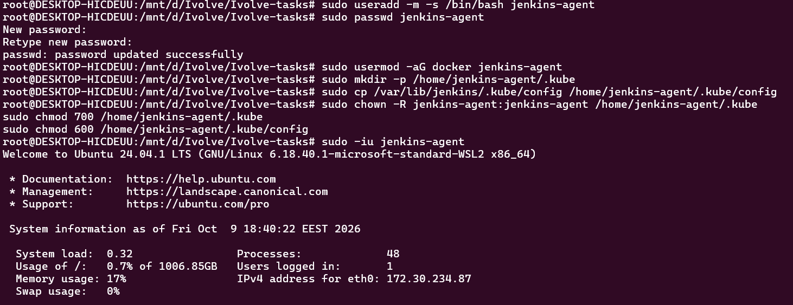
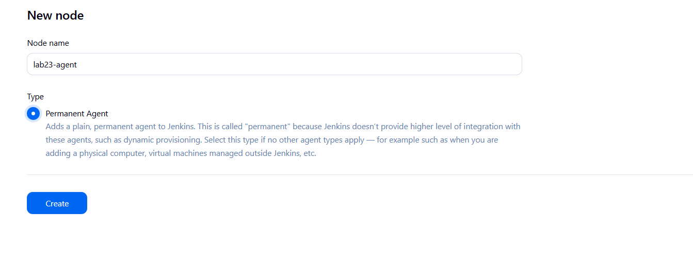
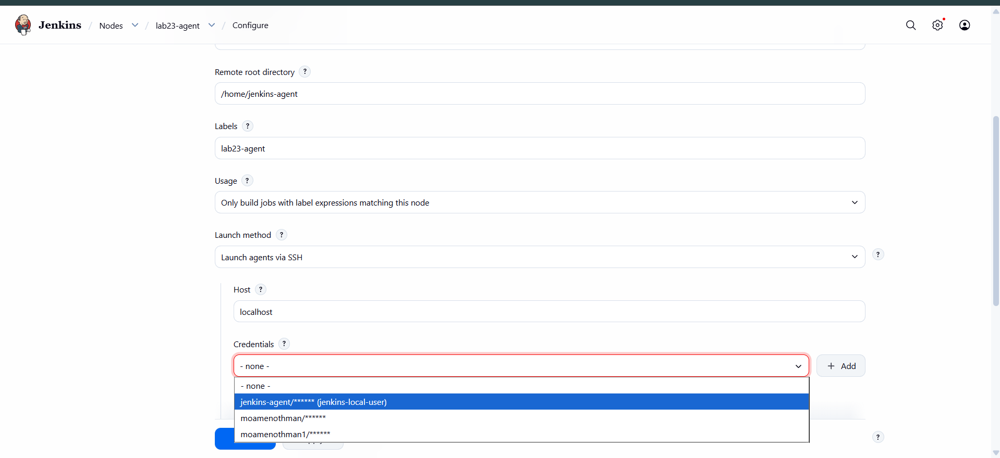
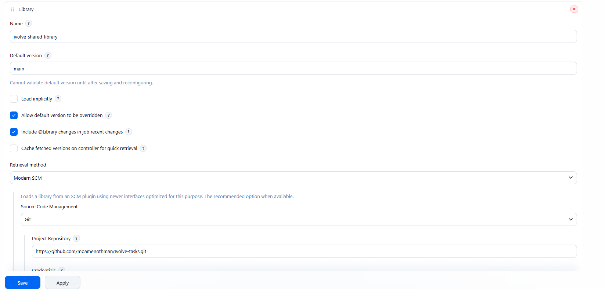
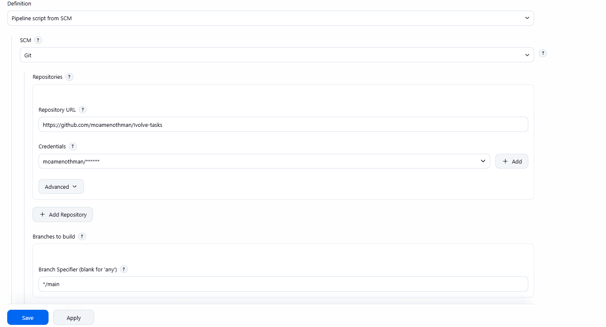
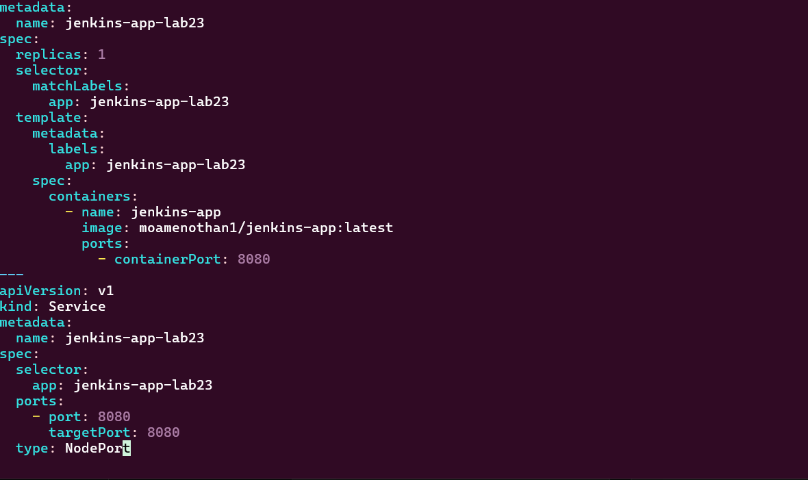
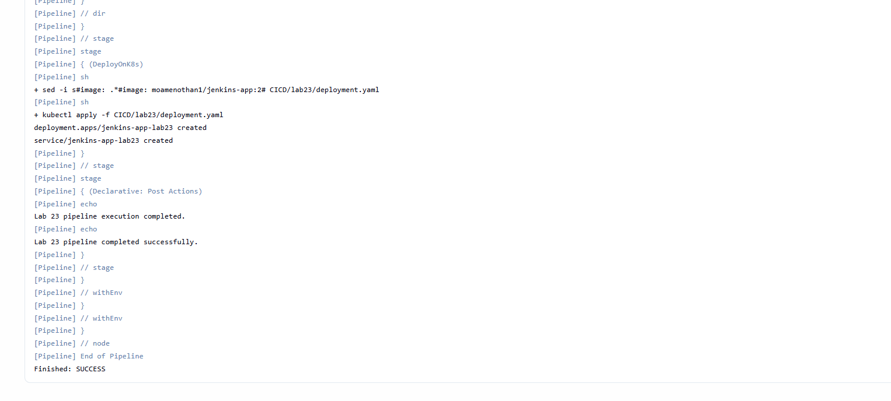
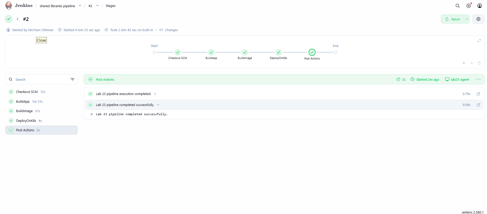

# Lab 23: CI/CD Pipeline Implementation with Jenkins Agents and Shared Libraries

## Overview

This lab demonstrates the implementation of a CI/CD pipeline using Jenkins Agents and Shared Libraries to automate application building, Docker image creation, and Kubernetes deployment.

The pipeline consists of three main stages:

1. **BuildApp** – Clone the application source code and build the Java application using Maven.
2. **BuildImage** – Build a Docker image for the application.
3. **DeployOnK8s** – Deploy the application to Kubernetes using a deployment manifest.

The pipeline runs on a dedicated Jenkins agent labelled `lab23-agent` and uses a reusable Shared Library to organize common pipeline operations.

## Repository Structure

```text
lab23/
├── Jenkinsfile
├── deployment.yaml
├── README.md
├── screenshots/
│   ├── add_shared_library.png
│   ├── create_jenkins_user.png
│   ├── create_node.png
│   ├── create_pipeline.png
│   ├── deployment_yaml.png
│   ├── node_configure.png
│   ├── pipeline_console_output.png
│   └── pipeline_stages_success.png
└── shared-library/
    └── vars/
        ├── buildApp.groovy
        ├── buildImage.groovy
        └── deployOnK8s.groovy
```

## Prerequisites

- Jenkins with Pipeline and SSH Build Agents support.
- A configured Jenkins agent labelled `lab23-agent`.
- Docker installed and accessible to the agent.
- Git installed on the agent.
- `kubectl` configured to access the Kubernetes cluster.
- A running Kubernetes cluster, such as Minikube.
- The Shared Library configured in Jenkins.

## Jenkins Agent Configuration

A dedicated Linux user named `jenkins-agent` was created for running pipeline jobs.

The Jenkins agent was configured with the following settings:

- **Node name:** `lab23-agent`
- **Remote root directory:** `/home/jenkins-agent`
- **Label:** `lab23-agent`
- **Launch method:** Launch agents via SSH

The agent has access to Docker and Kubernetes so it can build container images and apply Kubernetes manifests.

## Shared Library Configuration

The Shared Library is configured in Jenkins with the name:

`ivolve-shared-library`

It uses the `main` branch of the repository and the following library path:

`CICD/lab23/shared-library`

The library contains three reusable pipeline functions:

| File | Function | Purpose |
|---|---|---|
| `buildApp.groovy` | `buildApp()` | Builds the Java application using Maven in a Java 17 container. |
| `buildImage.groovy` | `buildImage()` | Builds a Docker image from the application Dockerfile. |
| `deployOnK8s.groovy` | `deployOnK8s()` | Applies the Kubernetes manifest using `kubectl`. |

The Jenkinsfile loads the library with:

```groovy
@Library('ivolve-shared-library') _
```

This allows the pipeline to call the shared functions without duplicating their implementation inside the Jenkinsfile.

## Pipeline Stages

### 1. BuildApp

The pipeline clones the application source code from:

https://github.com/Ibrahim-Adel15/Jenkins_App.git

It then calls `buildApp()` from the Shared Library to build the application with Maven.

### 2. BuildImage

The pipeline calls `buildImage()` to build a Docker image using the application's Dockerfile.

The image tag is generated from the Jenkins build number.

### 3. DeployOnK8s

The pipeline updates the image reference in `deployment.yaml` to match the image tag for the current build, then calls `deployOnK8s()` to apply the Kubernetes manifest.

**Note:** If the Kubernetes cluster must pull the image from a remote registry, the image must be pushed to that registry before deployment, and the manifest must reference the pushed image.

## Screenshots

### 1. Create the Jenkins Agent User



### 2. Create the Jenkins Agent Node



### 3. Configure the Jenkins Agent



### 4. Configure the Shared Library



### 5. Create the Pipeline Job



### 6. Kubernetes Deployment Manifest



### 7. Pipeline Console Output



### 8. Successful Pipeline Stages



## Verification

After running the pipeline, verify the Kubernetes resources with:

```bash
kubectl get deployments
kubectl get pods
kubectl get services
```

Review the Jenkins console output to confirm that the pipeline ran on the configured agent and that all three stages completed successfully.

## Shared Library Reusability

The Shared Library separates common build and deployment logic from the Jenkinsfile. The same library functions can be reused by other Jenkins pipelines, reducing duplication and making the pipeline logic easier to maintain.

To fully demonstrate this requirement, configure a second Jenkins Pipeline job that loads `ivolve-shared-library` and calls its shared functions.

## Conclusion

This lab demonstrates how Jenkins Agents and Shared Libraries can be combined to create a modular CI/CD pipeline for building a Java application, creating a Docker image, and deploying an application to Kubernetes.

