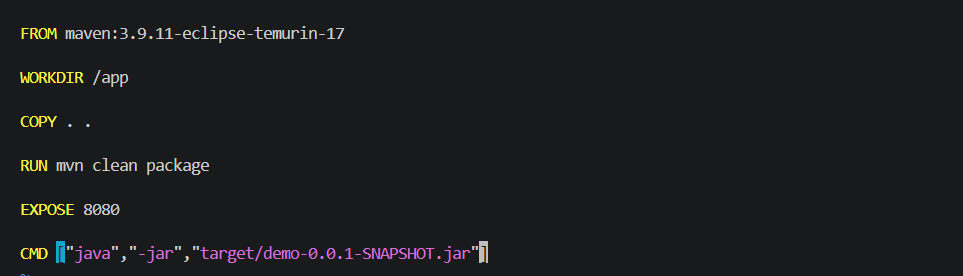
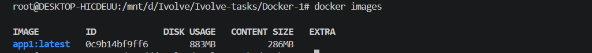
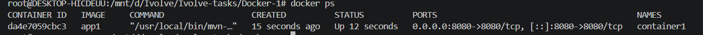
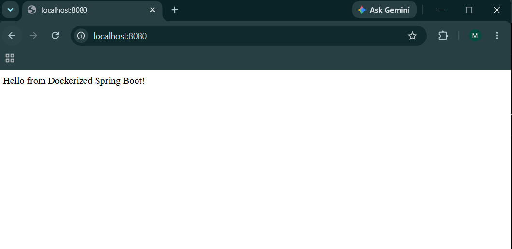

# Lab 3: Run Java Spring Boot Application in a Container

## Overview

This lab demonstrates how to containerize a Java Spring Boot application using Docker.

The application source code was cloned from GitHub, then a Docker image was created using a Dockerfile. The application was built using Maven inside the container and executed as a Spring Boot JAR application.

---

## Objectives

* Clone the Spring Boot application source code.
* Create a Dockerfile for the application.
* Use Maven with Java 17 to build the application.
* Create a Docker image.
* Run a container from the created image.
* Test the running Spring Boot application.
* Stop and remove the container.

---

## Technologies Used

* Java 17
* Spring Boot
* Maven
* Docker
* Docker Desktop
* WSL 2

---

# Dockerfile

The Dockerfile is used to build and run the Spring Boot application inside a Docker container.

```dockerfile
FROM maven:3.9.11-eclipse-temurin-17

WORKDIR /app

COPY . .

RUN mvn clean package

EXPOSE 8080

CMD ["java", "-jar", "target/demo-0.0.1-SNAPSHOT.jar"]
```

---

# Build Docker Image

The Docker image was created using the following command:

```bash
docker build -t app1 .
```

Check the created image:

```bash
docker images
```

The image size was recorded after the build process.

---

# Run Docker Container

A container was created from the image:

```bash
docker run -d --name container1 -p 8080:8080 app1
```

Check running containers:

```bash
docker ps
```

---

# Test the Application

The Spring Boot application was tested through the browser:

```
http://localhost:8080
```

It was also tested using curl:

```bash
curl localhost:8080
```

---

# Container Logs

Application logs can be viewed using:

```bash
docker logs container1
```

---

# Stop and Remove Container

Stop the running container:

```bash
docker stop container1
```

Remove the container:

```bash
docker rm container1
```

---

# Screenshots

## Dockerfile



## Docker Image



## Docker Container



## Application Test



---

# Result

Successfully containerized and deployed a Java Spring Boot application using Docker.

The application was built, packaged, and executed inside a Docker container running on Docker Desktop with WSL 2 integration.
