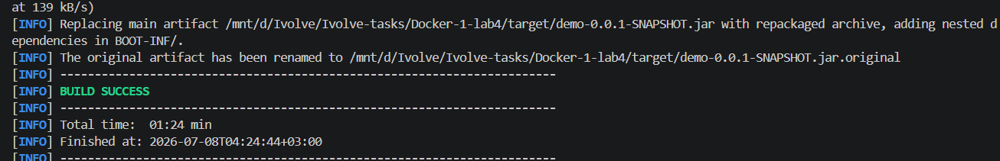
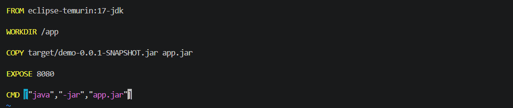
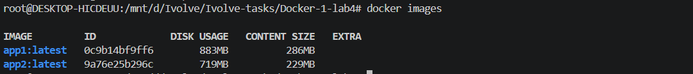
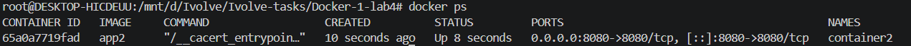
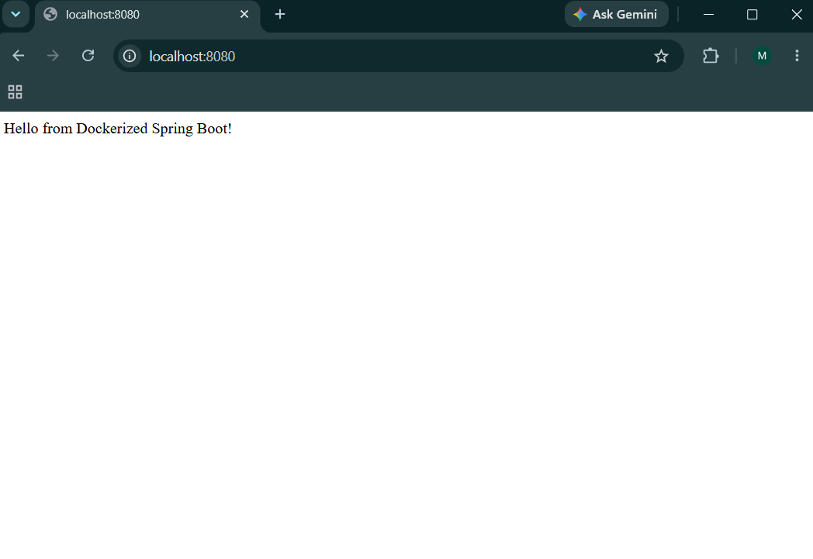

# Lab 4: Run Java Spring Boot Application in a Container

## Overview

This lab demonstrates how to run a Java Spring Boot application inside a Docker container using a pre-built JAR file.

Unlike the previous lab, the application is built outside the Docker image using Maven. The generated JAR file is then copied into a lightweight Java 17 Docker image and executed inside a container.

---

## Objectives

* Clone the Spring Boot application source code.
* Build the application using Maven.
* Create a Dockerfile using Java 17 base image.
* Copy the generated JAR file into the Docker image.
* Build a Docker image.
* Run the application inside a Docker container.
* Test the running application.
* Stop and remove the container.

---

## Technologies Used

* Java 17
* Spring Boot
* Maven
* Docker
* Docker Desktop
* WSL 2

---

# Build Application

The application was built using Maven before creating the Docker image.

Run:

```bash
mvn clean package
```


After a successful build, the generated JAR file is located at:

```
target/demo-0.0.1-SNAPSHOT.jar
```

---

# Dockerfile

The Dockerfile uses a Java 17 base image and runs the pre-built Spring Boot JAR file.

```dockerfile
FROM eclipse-temurin:17-jdk

WORKDIR /app

COPY target/demo-0.0.1-SNAPSHOT.jar app.jar

EXPOSE 8080

CMD ["java","-jar","app.jar"]
```



---

# Build Docker Image

The Docker image was created using:

```bash
docker build -t app2 .
```

Check the created image:

```bash
docker images
```


The image size was recorded after the build process.

---

# Run Docker Container

A container was created from the image:

```bash
docker run -d --name container2 -p 8080:8080 app2
```

Check running containers:

```bash
docker ps
```

---

# Test Application

The Spring Boot application was tested using:

Browser:

```
http://localhost:8080
```


or using curl:

```bash
curl localhost:8080
```

---

# Container Logs

Application logs can be displayed using:

```bash
docker logs container2
```

---

# Stop and Remove Container

Stop the container:

```bash
docker stop container2
```

Remove the container:

```bash
docker rm container2
```

---

# Result

Successfully built and deployed a Java Spring Boot application using Docker.

The application was packaged as a JAR file using Maven, copied into a Java 17 Docker image, and executed successfully inside a Docker container.
