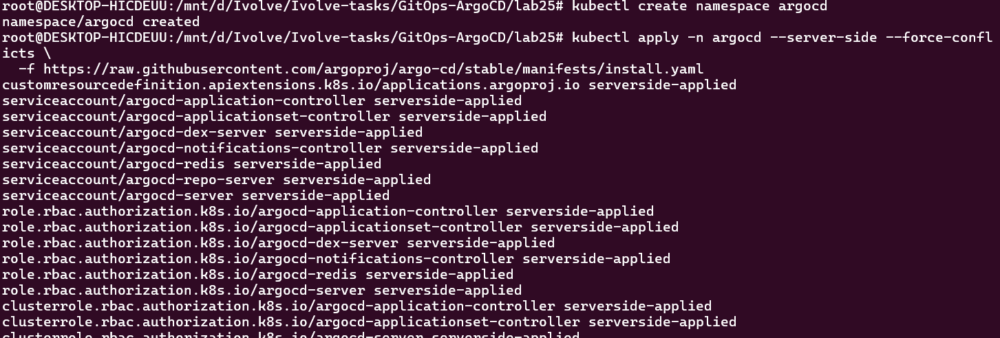
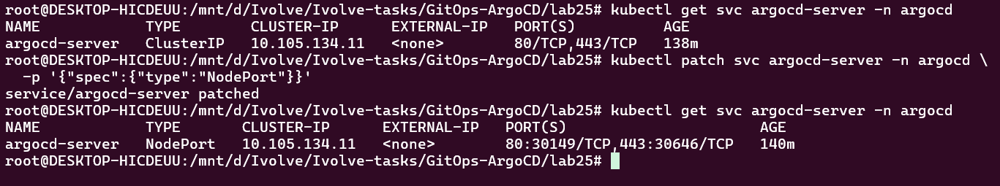
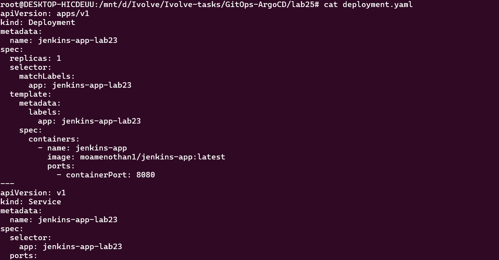
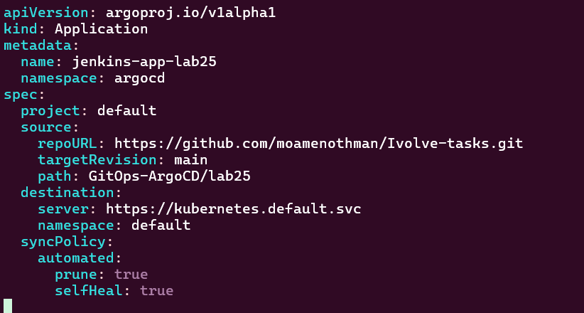
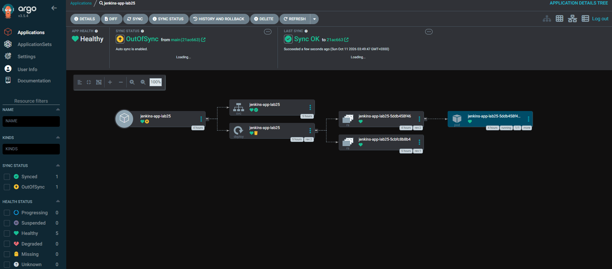
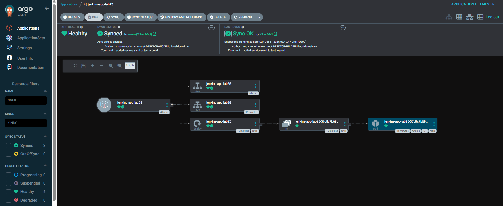
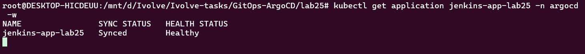
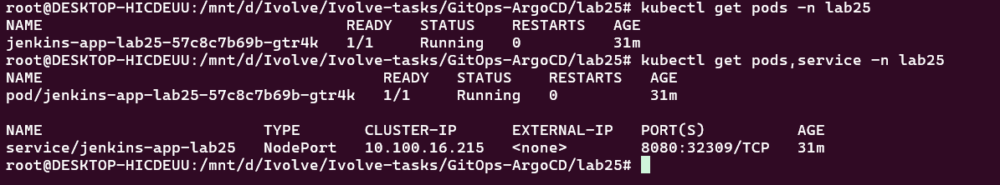

# Lab 25: GitOps with Argo CD

## Overview

This lab demonstrates how to implement a GitOps workflow using **Argo CD**, Kubernetes, GitHub, and Jenkins.

The lab begins with an existing application Deployment in the Kubernetes `default` namespace. The application configuration is then reorganized into a dedicated `lab25` namespace, with the Kubernetes Service defined separately in `service.yaml`.

Argo CD monitors the Git repository and reconciles the Kubernetes resources with the desired configuration stored in Git. The lab also demonstrates how changes to the repository affect the application's synchronization status.

## Objectives

- Install and access Argo CD.
- Configure an Argo CD Application to track a Git repository.
- Deploy an application through GitOps.
- Move application resources from the `default` namespace to a dedicated `lab25` namespace.
- Separate the Deployment and Service into individual YAML manifests.
- Configure a NodePort Service.
- Understand `OutOfSync` and `Synced` states.
- Verify Argo CD components and application resources.
- Understand the role of Jenkins and Jenkins Shared Libraries in a CI/CD workflow.

## Repository Structure

```text
lab25/
├── Jenkinsfile
├── README.md
├── argocd/
│   └── lab25-application.yaml
├── deployment.yaml
├── service.yaml
└── screenshots/
    ├── application_in_argo_cd_ui_before_change_in _the_repo.png
    ├── argocd_autosynced.png
    ├── argocd_out_of_sync.png
    ├── change_argo_server_nodeport_to_access_ui.png
    ├── deployment_yaml.png
    ├── get_application.png
    ├── get_pods_argocd_ns.png
    ├── get_pods_service_after_sync.png
    ├── install_argocd.png
    └── lab25_app_yaml.png
```

## Architecture

```text
                    GitHub Repository
                           |
              +------------+------------+
              |                         |
              v                         v
         Jenkins CI/CD               Argo CD
              |                         |
              v                         v
       Container Registry       GitOps Reconciliation
                                        |
                                        v
                               Kubernetes Cluster
                                        |
                                        v
                              Namespace: lab25
                                  |         |
                                  v         v
                              Deployment  Service
                                  |
                                  v
                               Application
```

### Component Responsibilities

- **Jenkins:** Automates CI/CD tasks, including application build and container image publishing.
- **Jenkins Shared Library:** Provides reusable pipeline logic that can be shared across Jenkins pipelines.
- **GitHub:** Stores the Kubernetes manifests and acts as the source of truth for the desired deployment configuration.
- **Argo CD:** Monitors Git and synchronizes Kubernetes resources with the desired state.
- **Kubernetes:** Runs the application inside the configured namespace and exposes it through a Service.

## 1. Install Argo CD

Argo CD is installed in a dedicated namespace named `argocd`, separate from the namespace used by the application.

Create the namespace:

```bash
kubectl create namespace argocd
```

Install Argo CD:

```bash
kubectl apply -n argocd \
  -f https://raw.githubusercontent.com/argoproj/argo-cd/stable/manifests/install.yaml
```

Verify the installation:

```bash
kubectl get pods -n argocd
```

Wait for the required components to become ready:

```bash
kubectl get pods -n argocd -w
```

Inspect the installed Services:

```bash
kubectl get services -n argocd
```

### Installation Verification

The following screenshot documents the Argo CD installation in the Kubernetes cluster.



## 2. Access the Argo CD UI

To access the Argo CD web interface, the Argo CD server can be exposed through port forwarding or through a NodePort Service.

For local port forwarding, run:

```bash
kubectl port-forward -n argocd svc/argocd-server 8081:443
```

Then open:

```text
https://localhost:8081
```

The browser may display a certificate warning because the local HTTPS certificate may not be trusted by the browser.

For the initial administrator password, if the default installation credentials are still present:

```bash
kubectl -n argocd get secret argocd-initial-admin-secret \
  -o jsonpath="{.data.password}" | base64 -d
echo
```

Sign in using the `admin` username and the retrieved password. Change the initial password after the first login.

### Argo CD Server Access Configuration

The following screenshot documents the NodePort configuration used to access the Argo CD server UI.



> **Note:** Exposing the Argo CD server through NodePort is different from exposing the application itself. Argo CD runs in the `argocd` namespace, while the application resources are managed separately.

## 3. Initial Application Deployment in the Default Namespace

The application was initially configured as a Kubernetes Deployment in the `default` namespace.

At this stage, the application Deployment and its container configuration were managed through Kubernetes YAML manifests. The Argo CD Application was then configured to track the Git repository containing the deployment configuration.

The application uses the container image:

```text
moamenothman1/jenkins-app:latest
```

The container listens on port `8080`. The image reference in the manifest must match an image available in the container registry.

### Initial Application State in Argo CD

The following screenshot records the application as displayed in the Argo CD UI before the subsequent repository changes.


This initial state provides a reference point for understanding the changes introduced in the following steps.

## 4. Move the Application to the lab25 Namespace

After the initial deployment, the configuration was reorganized to use a dedicated namespace named `lab25` instead of `default`.

Using a dedicated namespace separates the application's resources from other workloads and makes the deployment easier to manage.

The intended structure is:

- `argocd`: Contains Argo CD's own components and the Argo CD Application resource.
- `lab25`: Contains the application Deployment, Pods, and Service.

The namespace used by the Argo CD Application destination must be consistent with the intended application namespace and the Kubernetes manifests.

### Why Namespace Consistency Matters

Kubernetes namespaces provide logical separation between resources. However, moving a workload from one namespace to another is not the same as simply renaming an existing resource.

A Deployment created in `default` and a Deployment created in `lab25` are separate Kubernetes objects. Resources must be reconciled in the intended namespace, and the old resources may need to be removed after the new deployment has been verified.

The final configuration should therefore consistently identify `lab25` as the application namespace.

## 5. Separate the Deployment and Service Manifests

The application configuration was organized into two files:

- `deployment.yaml`: Defines the application Deployment.
- `service.yaml`: Defines the Service that exposes the application.

Separating these resources makes the Kubernetes configuration easier to read, maintain, and manage through GitOps.

### Deployment Configuration

The Deployment defines the application workload, including its container image, replica count, selector, labels, and container port.

The Deployment selector must match the labels assigned to the Pods.

The container listens on port `8080`.



### Service Configuration

The Service selects the application Pods using their labels and forwards traffic to the application's container port.

The application Service uses the `NodePort` type, which exposes a port on the Kubernetes nodes. Actual accessibility depends on the cluster environment and network configuration.

The Service definition is maintained separately in `service.yaml`, rather than being embedded in `deployment.yaml`.

Keeping these resources separate makes it easier to update the workload and its network exposure independently.

## 6. Configure the Argo CD Application

The Argo CD Application manifest is located at:

```text
argocd/lab25-application.yaml
```

It defines the Git repository, target revision, manifest path, destination cluster, destination namespace, and synchronization policy.

The repository configuration used in this lab is:

```text
Repository: https://github.com/moamenothman/Ivolve-tasks.git
Branch:     main
Path:       GitOps-ArgoCD/lab25
```

The destination namespace should be configured for the final application location, `lab25`.

Apply the Application manifest:

```bash
kubectl apply -f argocd/lab25-application.yaml
```

Verify that the Application resource exists:

```bash
kubectl get applications -n argocd
```

If the Argo CD CLI is installed and authenticated, the Application can also be inspected with:

```bash
argocd app get jenkins-app-lab25
```

### Argo CD Application Manifest



The manifest connects Argo CD to the repository and defines where the desired Kubernetes resources should be deployed.

## 7. Synchronize the Updated Configuration

Once the updated manifests are committed and pushed to GitHub, Argo CD can detect the difference between the desired state in Git and the live state in Kubernetes.

The workflow is:

1. Update the Kubernetes manifests in the Git repository.
2. Commit and push the changes to the configured branch.
3. Allow Argo CD to refresh the repository state.
4. Review the synchronization status.
5. Verify that the resources are deployed in the intended namespace.

If automated synchronization is enabled, Argo CD can apply eligible changes automatically.

### OutOfSync State

An application may become `OutOfSync` when the desired configuration stored in Git differs from the live configuration.

This status is useful when validating changes to the Deployment, namespace configuration, or other managed resources.



### Automated Synchronization

After Argo CD successfully reconciles the desired configuration, the application can return to the `Synced` state.

The following screenshot documents the automatic synchronization result.



### Automated Sync, Pruning, and Self-Healing

The Application synchronization policy can include automated sync, pruning, and self-healing.

Example:

```yaml
spec:
  syncPolicy:
    automated:
      prune: true
      selfHeal: true
```

- **Automated Sync:** Applies eligible changes detected in Git.
- **Prune:** Removes managed resources that are no longer declared in Git.
- **Self-Heal:** Reconciles live-state changes that differ from the desired configuration.

These options should be configured in the existing Application manifest without overwriting the repository or destination settings.

Pruning should be used carefully, particularly when changing namespaces or reorganizing resources, because resources removed from the desired configuration may be deleted.

## 8. Verify the Application and Kubernetes Resources

After synchronization, verify that the Argo CD Application exists and that the application resources are running in the intended namespace.

### Check the Argo CD Application

```bash
kubectl get applications -n argocd
```

The Argo CD Application custom resource is stored in the `argocd` namespace even when it manages workloads in `lab25`.



### Check Argo CD Components

```bash
kubectl get pods -n argocd
```

This command checks the Pods belonging to Argo CD itself.


### Check Application Pods and Service

```bash
kubectl get pods,services -n lab25
```

Verify the Deployment and its related resources:

```bash
kubectl get deployments,replicasets,pods,services -n lab25
```

The following screenshot documents the application Pods and Service after synchronization.



The resources should be checked in `lab25`, rather than assuming the application is still running in `default`.

If the Service is a NodePort, inspect the allocated port:

```bash
kubectl get service -n lab25
```

If the Deployment or Service is not found, verify the destination namespace in the Argo CD Application manifest and the namespace configuration in the Kubernetes manifests.

## 9. Jenkins Shared Library Integration

A Jenkins Shared Library provides reusable pipeline logic that can be shared across multiple Jenkins pipelines.

Instead of duplicating common operations in every `Jenkinsfile`, shared pipeline steps can be maintained in a separate repository and imported by Jenkins jobs.

A typical Shared Library repository may contain:

```text
shared-library/
├── vars/
│   └── reusableStep.groovy
└── src/
    └── ...
```

The `vars/` directory commonly contains reusable pipeline steps, while `src/` can contain supporting Groovy classes.

### Benefits

- **Reusability:** Common pipeline logic can be used across multiple projects.
- **Maintainability:** Shared logic can be updated centrally.
- **Consistency:** Pipelines can follow common build and deployment practices.
- **Readability:** A `Jenkinsfile` can focus on the workflow instead of implementation details.

In this workflow, Jenkins handles CI-related operations such as building and publishing the application image, while Argo CD handles Kubernetes deployment reconciliation using the configuration stored in Git.

The Shared Library name and its specific functions depend on the library configured in Jenkins.

## 10. Understanding the Final GitOps Workflow

The final workflow separates continuous integration from continuous delivery:

1. Jenkins executes the CI pipeline.
2. The application container image is built and published.
3. The Kubernetes manifests in Git specify the desired application configuration.
4. Argo CD monitors the configured Git repository and revision.
5. Argo CD compares the desired configuration with the live Kubernetes resources.
6. Changes are synchronized according to the configured policy.
7. Kubernetes runs the application in the `lab25` namespace.
8. The application Service exposes the workload according to its configured Service type.

For reliable deployments, use an appropriate image tag and ensure that the corresponding manifest changes are committed to Git. Publishing a new image under an unchanged tag does not necessarily cause Argo CD to detect a Git configuration change.

## 11. Troubleshooting

### Argo CD Pods Are Not Running

```bash
kubectl get pods -n argocd
kubectl get events -n argocd --sort-by=.metadata.creationTimestamp
```

Inspect an affected Pod:

```bash
kubectl describe pod <pod-name> -n argocd
```

### Application Is OutOfSync

Check the Application's resource differences in the Argo CD UI and verify:

- The Git repository URL.
- The target revision.
- The manifest path.
- The destination namespace.
- The synchronization policy.
- Whether the latest changes were pushed to GitHub.

### Application Is in an Unexpected Namespace

Inspect the Deployment and Service namespaces:

```bash
kubectl get deployments,services -A
```

Check the Application destination configuration and the manifests to ensure that the application is intended to run in `lab25`.

A resource in `default` is not the same object as a resource with the same name in `lab25`.

### Pods Are Not Ready

```bash
kubectl get pods -n lab25
kubectl describe pod <pod-name> -n lab25
kubectl logs <pod-name> -n lab25
```

Verify the image reference, container logs, Pod events, and Deployment selector.

### Service Is Not Accessible

```bash
kubectl get service -n lab25
kubectl get endpoints -n lab25
kubectl get pods -n lab25 --show-labels
```

Verify that the Service selector matches the application Pod labels and that the target port is correct.

A NodePort Service does not guarantee external access in every local Kubernetes environment. Cluster networking, firewall rules, and the node's reachable address can affect connectivity.

## Conclusion

This lab demonstrates how to manage a Kubernetes application using GitOps with Argo CD.

The application was initially deployed in the `default` namespace and subsequently reorganized into the dedicated `lab25` namespace. The Deployment and Service were separated into individual YAML manifests, and Argo CD was configured to monitor and synchronize the desired state from Git.

The lab also demonstrates how to inspect synchronization states, verify Kubernetes resources, and separate Jenkins CI responsibilities from Argo CD deployment management.

## Technologies Used

- Kubernetes
- Argo CD
- Git and GitHub
- Jenkins
- Jenkins Shared Libraries
- Docker
- YAML
- GitOps
- Minikube

