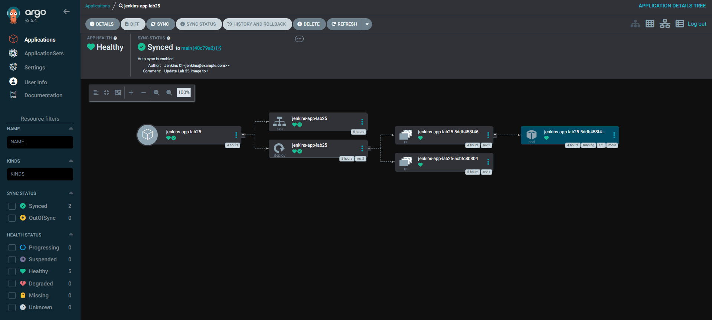
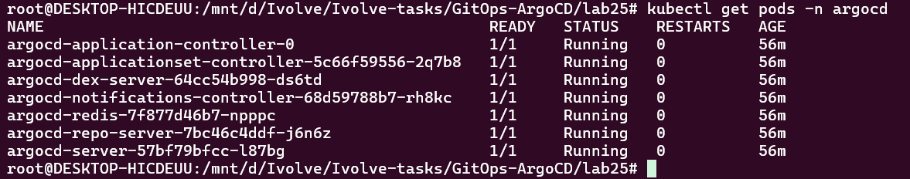

# Lab 25: GitOps with Argo CD

## Overview

This lab demonstrates how to implement a GitOps workflow using **Argo CD** to deploy and manage a Kubernetes application from a Git repository.

Argo CD continuously monitors the application's desired state stored in Git and compares it with the live state of the Kubernetes cluster. This makes it possible to detect configuration drift, synchronize changes, and maintain the desired application state declaratively.

The lab uses a Kubernetes application previously built and published through a Jenkins CI/CD pipeline. Jenkins handles the build and image publishing process, while Argo CD manages the application's deployment through Git.

## Objectives

- Install and access Argo CD.
- Configure a Git repository as the source of truth for Kubernetes manifests.
- Create an Argo CD Application resource.
- Deploy the application using GitOps.
- Configure automatic synchronization, pruning, and self-healing.
- Observe `Synced`, `OutOfSync`, and application health states.
- Verify the Kubernetes Deployment, Pods, and Service.
- Understand how a Jenkins Shared Library supports reusable CI/CD pipeline logic.

## Repository Structure

```text
lab25/
├── Jenkinsfile
├── argocd/
│   └── lab25-application.yaml
├── deployment.yaml
├── service.yaml
├── README.md
└── screenshots/
    ├── application_in_argo_cd_ui.png
    ├── argocd_autosynced.png
    ├── argocd_out_of_sync.png
    ├── change_to_nodeport.png
    ├── deployment_yaml.png
    ├── get_application.png
    ├── get_pods.png
    ├── install_argocd.png
    └── lab25_app_yaml.png
```

## Architecture

```text
Developer
   |
   v
GitHub Repository
   |
   +-----------------------------+
   |                             |
   v                             v
Jenkins CI/CD                Argo CD
   |                             |
   | Build and publish image     | Monitor Git manifests
   |                             |
   v                             v
Container Registry          Kubernetes Cluster
                                 |
                                 v
                         Deployment and Pods
                                 |
                                 v
                            NodePort Service
```

Jenkins and Argo CD have separate responsibilities:

- **Jenkins:** Automates application build and container image publishing.
- **GitHub:** Stores the application source and Kubernetes manifests.
- **Argo CD:** Reconciles the live Kubernetes resources with the manifests stored in Git.
- **Kubernetes:** Runs the application and exposes it through a Service.

## 1. Install Argo CD

Argo CD can be installed in a dedicated Kubernetes namespace named `argocd`.

Create the namespace:

```bash
kubectl create namespace argocd
```

Install the Argo CD components:

```bash
kubectl apply -n argocd \
  -f https://raw.githubusercontent.com/argoproj/argo-cd/stable/manifests/install.yaml
```

Verify the installation:

```bash
kubectl get pods -n argocd
```

Wait until the required Argo CD components are running:

```bash
kubectl get pods -n argocd -w
```

Check the installed services:

```bash
kubectl get svc -n argocd
```

### Installation Screenshot


## 2. Access the Argo CD UI

For a local Kubernetes environment, port forwarding can be used to access the Argo CD web interface.

```bash
kubectl port-forward -n argocd svc/argocd-server 8081:443
```

Open the following address in your browser:

```text
https://localhost:8081
```

The browser may display a certificate warning because the local Argo CD endpoint uses HTTPS with a certificate that may not be trusted by the browser.

For an initial administrator password, if the default installation credentials have not been changed:

```bash
kubectl -n argocd get secret argocd-initial-admin-secret \
  -o jsonpath="{.data.password}" | base64 -d
echo
```

Use the `admin` username and the retrieved password to sign in. Change the initial password after the first login, and avoid storing credentials in Git.

## 3. Configure the Kubernetes Manifests

The repository contains two Kubernetes manifest files:

- `deployment.yaml`: Defines the application Deployment.
- `service.yaml`: Defines the Service used to expose the application.

### Deployment

The Deployment defines the application workload, its container image, replica count, labels, and container port.

The application image used in this lab is:

```text
moamenothman1/jenkins-app:latest
```

Ensure that the image reference in the manifest matches the image published by the Jenkins pipeline. If Jenkins publishes versioned tags, use the corresponding tag rather than assuming `latest` is always current.

The application container listens on port `8080`.

### Service

The Service selects the application Pods using matching labels and exposes port `8080` through a `NodePort` Service.

A NodePort Service can make the application reachable through a Kubernetes node's IP address and allocated NodePort, subject to the cluster configuration and network access.

### Deployment Manifest Screenshot


### NodePort Configuration Screenshot


## 4. Configure the Argo CD Application

The file `argocd/lab25-application.yaml` defines the Argo CD Application resource.

It connects Argo CD to the Git repository and identifies the directory containing the Kubernetes manifests.

The repository configuration used for this lab is:

```text
Repository: https://github.com/moamenothman/Ivolve-tasks.git
Branch:     main
Path:       GitOps-ArgoCD/lab25
```

The Application resource specifies:

- The Git repository containing the desired configuration.
- The target revision to monitor.
- The path containing the Kubernetes manifests.
- The destination Kubernetes cluster.
- The destination namespace.
- The synchronization policy.

The destination namespace in the Application configuration must match the intended namespace for the application resources. If the manifests specify a namespace explicitly, make sure the configuration is consistent.

### Apply the Application

From the repository directory, run:

```bash
kubectl apply -f argocd/lab25-application.yaml
```

Check the created Application resource:

```bash
kubectl get applications -n argocd
```

If the Argo CD command-line interface is installed, you can also inspect the application with:

```bash
argocd app get jenkins-app-lab25
```

The Kubernetes command is sufficient for confirming that the Application custom resource exists; the Argo CD CLI command requires the CLI to be installed and authenticated.

### Argo CD Application Manifest


### Application in the Argo CD UI



## 5. Enable Automated Synchronization

Argo CD compares the desired state stored in Git with the actual state running in Kubernetes.

The synchronization policy can enable automated reconciliation and specify whether Argo CD should remove resources deleted from Git and correct manual changes made to the live cluster.

The policy used in this lab includes:

- **Automated Sync:** Automatically applies detected Git changes.
- **Prune:** Removes managed resources that are no longer defined in Git.
- **Self-Heal:** Reconciles live-state changes that differ from the desired state in Git.

These options should be configured in the `spec.syncPolicy` section of the Application manifest.

Example:

```yaml
spec:
  syncPolicy:
    automated:
      prune: true
      selfHeal: true
```

This is an example of the automated synchronization section; preserve the existing repository, destination, and other Application settings when updating the file.

### Automatic Synchronization Screenshot


## 6. Observe OutOfSync and Synced States

One of the key goals of this lab is to understand how Argo CD detects configuration drift.

### OutOfSync

An application becomes `OutOfSync` when the desired configuration in Git differs from the live configuration in the Kubernetes cluster.

For example, changing a tracked Kubernetes manifest without applying the change to the cluster can cause Argo CD to detect a difference.

The exact status depends on the manifest change, the resource, and the current synchronization policy.


### Synced

After Argo CD successfully reconciles the application, the synchronization status should become `Synced`.

With automated synchronization enabled, Argo CD can apply eligible changes without requiring a manual synchronization action.

A `Synced` status indicates that the live resources match the desired state for the resources Argo CD manages. It does not, by itself, guarantee that the application is healthy.

### Important Difference

| Status | Meaning |
|---|---|
| `Synced` | Live resources match the desired Git configuration. |
| `OutOfSync` | A difference exists between the desired and live configuration. |
| `Healthy` | The application's resources satisfy Argo CD's health assessment. |
| `Progressing` | One or more resources are still progressing toward their expected state. |
| `Degraded` | A resource is unhealthy according to its health assessment. |

## 7. Verify the Application in Kubernetes

After synchronization, verify that the application resources exist and that the Pods are running.

Check the Argo CD Application:

```bash
kubectl get applications -n argocd
```

Check the Deployment and Service:

```bash
kubectl get deployments,services -A
```

Check Pods across namespaces:

```bash
kubectl get pods -A
```

If the application is deployed into a dedicated namespace such as `lab25`, inspect it directly:

```bash
kubectl get all -n lab25
```

If the destination namespace is different, replace `lab25` with the configured namespace.

Inspect the Deployment:

```bash
kubectl describe deployment jenkins-app-lab25 -n lab25
```

Inspect the Service:

```bash
kubectl describe service jenkins-app-lab25 -n lab25
```

Check the Service's assigned NodePort:

```bash
kubectl get service jenkins-app-lab25 -n lab25
```

The namespace and resource names in these commands must match the final manifests.

### Application Status Screenshot


### Pods Screenshot



## 8. Jenkins Shared Library Integration

A Jenkins Shared Library provides reusable pipeline code that can be shared across multiple Jenkins pipelines.

Instead of duplicating build, test, Docker, or deployment logic in every `Jenkinsfile`, common functionality can be maintained in a separate Git repository and imported into pipelines.

A typical Jenkins Shared Library repository can contain:

```text
shared-library/
├── vars/
│   └── reusableStep.groovy
└── src/
    └── ...
```

The `vars/` directory commonly contains reusable pipeline steps, while `src/` can contain supporting Groovy classes.

### Benefits of Using a Shared Library

- **Reusability:** Common pipeline stages can be reused across projects.
- **Maintainability:** Pipeline logic can be updated in one place.
- **Consistency:** Projects can follow the same build and deployment conventions.
- **Readability:** The project's `Jenkinsfile` can focus on the workflow rather than implementation details.
- **Scalability:** Additional pipelines can adopt the same shared steps.

The `Jenkinsfile` in this lab is the entry point for the Jenkins pipeline. The Shared Library should be configured in Jenkins with the correct repository URL, credentials if required, and default version. The pipeline must then load the library using the configured library name.

The exact library name and function calls depend on the Shared Library implementation used in the lab.

### Jenkins and Argo CD Responsibilities

The CI/CD workflow separates image creation from application deployment:

1. Jenkins runs the pipeline and builds the application.
2. Jenkins builds and publishes the container image.
3. The Kubernetes manifest in Git references the image intended for deployment.
4. Argo CD monitors the Git repository.
5. Argo CD synchronizes the Kubernetes resources with the desired configuration.
6. Kubernetes runs the application using the declared Deployment and Service.

For reliable deployments, use a specific image tag or digest and ensure the manifest change is committed to Git. Publishing a new image under an unchanged tag alone does not necessarily create a detectable Git configuration change for Argo CD.

## 9. Troubleshooting

### Argo CD Pods Are Not Running

Inspect the affected Pods:

```bash
kubectl get pods -n argocd
kubectl describe pod <pod-name> -n argocd
kubectl logs <pod-name> -n argocd
```

Check cluster health and available resources:

```bash
kubectl get nodes
kubectl get events -n argocd --sort-by=.metadata.creationTimestamp
```

### Application Is OutOfSync

Check the Application in the Argo CD UI and review the resource differences.

Confirm that:

- The correct Git repository is configured.
- The target revision is correct.
- The manifest path is correct.
- The manifest files are committed and pushed.
- The destination cluster and namespace are correct.
- The synchronization policy is configured as intended.

### Application Status Is Unknown

A temporary repository connection or DNS problem can prevent Argo CD from retrieving the desired manifests.

Inspect the repository-server Pods and relevant logs:

```bash
kubectl get pods -n argocd
kubectl logs -n argocd deployment/argocd-repo-server
```

Check connectivity and DNS resolution from the cluster as appropriate. After resolving the underlying issue, refresh the Application in the UI or retry its comparison.

### Pods Are Not Ready

Inspect the Pod events and container logs:

```bash
kubectl describe pod <pod-name> -n lab25
kubectl logs <pod-name> -n lab25
```

Check that the image exists, that the image tag is correct, and that the Deployment selector matches the Pod labels.

### Service Is Not Accessible

Verify the Service type, allocated NodePort, endpoints, and Pod readiness:

```bash
kubectl get service jenkins-app-lab25 -n lab25
kubectl get endpoints jenkins-app-lab25 -n lab25
kubectl get pods -n lab25 --show-labels
```

A NodePort does not guarantee external reachability in every local Kubernetes setup. Network routing, firewall rules, and the cluster platform can affect access.

## 10. Screenshots and Evidence

The `screenshots/` directory contains evidence collected during the lab:

| Screenshot | Description |
|---|---|
| `install_argocd.png` | Argo CD installation |
| `lab25_app_yaml.png` | Argo CD Application manifest |
| `application_in_argo_cd_ui.png` | Application displayed in the Argo CD UI |
| `deployment_yaml.png` | Kubernetes Deployment configuration |
| `change_to_nodeport.png` | Service exposure configuration |
| `get_application.png` | Application resource verification |
| `get_pods.png` | Kubernetes Pod verification |
| `argocd_autosynced.png` | Automatic synchronization result |
| `argocd_out_of_sync.png` | Detected configuration drift |

## Conclusion

This lab demonstrates a GitOps deployment workflow using Argo CD and Kubernetes.

The application configuration is stored in Git, Argo CD monitors and reconciles that configuration with the live cluster, and Jenkins remains responsible for the CI workflow and container image publishing. A Jenkins Shared Library helps keep reusable pipeline logic organized and maintainable.

The lab also demonstrates how automated synchronization, pruning, and self-healing can reduce manual deployment work and help maintain consistency between Git and the Kubernetes cluster.

## Technologies Used

- Kubernetes
- Argo CD
- Git and GitHub
- Jenkins
- Jenkins Shared Libraries
- Docker
- YAML
- GitOps
- Minikube

