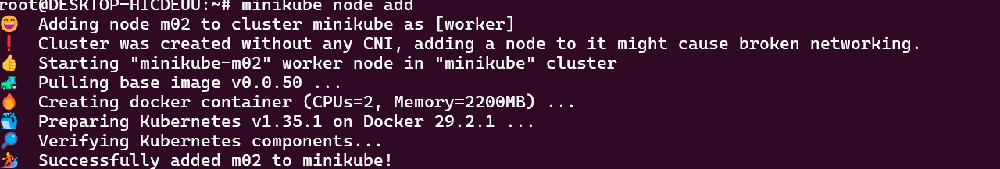
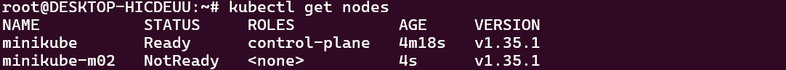
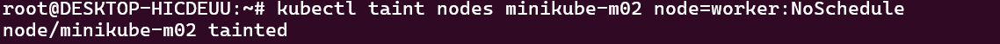
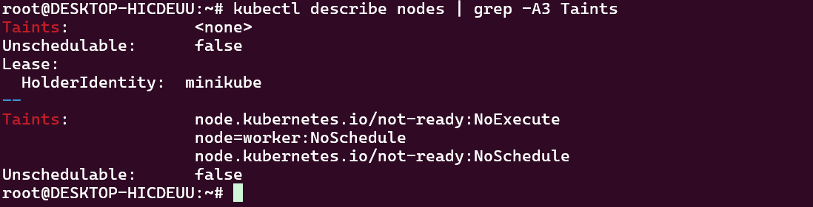

# Kubernetes Lab 10 – Node Isolation Using Taints

## Overview

This lab demonstrates how to isolate Kubernetes nodes using **taints**. A taint prevents pods from being scheduled on a specific node unless they have a matching toleration.

## Objectives

* Create a Kubernetes cluster with two nodes.
* Add a worker node to the Minikube cluster.
* Apply a taint to the worker node using the key-value pair `node=worker`.
* Verify the applied taint.

## Prerequisites

* Minikube
* kubectl
* Docker driver

---

## Project Structure

```text
.
├── README.md
└── screenshots
    ├── describe-taint.png
    ├── get-nodes.png
    ├── get-nodes2.png
    ├── node-add.png
    └── taint.png
```

---

## Step 1: Verify Existing Nodes

Display the current cluster nodes.

```bash
kubectl get nodes
```

**Output**


---

## Step 2: Add a Worker Node

Add a second node to the Minikube cluster.

```bash
minikube node add
```

**Output**



---

## Step 3: Verify Cluster Nodes

Confirm that the cluster now contains two nodes.

```bash
kubectl get nodes
```

**Output**



---

## Step 4: Apply a Taint

Apply a taint to the worker node to prevent scheduling pods without a matching toleration.

```bash
kubectl taint nodes minikube-m02 node=worker:NoSchedule
```

**Output**



---

## Step 5: Verify the Taint

Describe the worker node to confirm the taint has been applied.

```bash
kubectl describe node minikube-m02
```

Look for:

```text
Taints:
node=worker:NoSchedule
```

**Output**



---

## Commands Summary

```bash
kubectl get nodes

minikube node add

kubectl get nodes

kubectl taint nodes minikube-m02 node=worker:NoSchedule

kubectl describe node minikube-m02
```

---

## Result

The Minikube cluster was successfully configured with two nodes. A **NoSchedule** taint was applied to the worker node using the key-value pair `node=worker`, ensuring that pods cannot be scheduled on that node unless they define a matching toleration.

