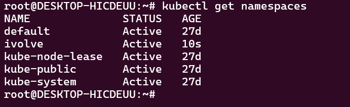
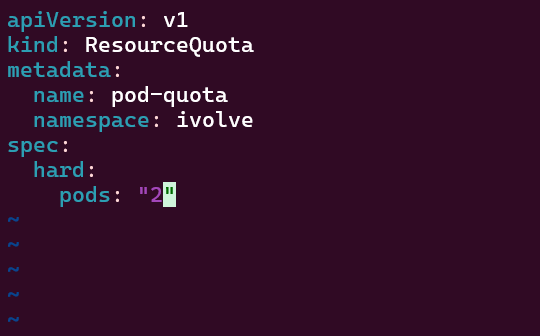
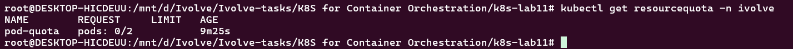

# Lab 11: Namespace Management and Resource Quota Enforcement

## Objective

The objective of this lab is to create a dedicated Kubernetes namespace and enforce a resource quota that limits the number of Pods that can run within the namespace to **2 Pods**.

## Tasks Completed

* Created a Kubernetes namespace named `ivolve`.
* Created a `ResourceQuota` named `pod-quota`.
* Configured the quota to allow a maximum of **2 Pods** in the `ivolve` namespace.
* Verified the namespace and resource quota using Kubernetes commands.
* Verified the quota configuration using `kubectl describe`.

## Project Structure

```text
.
├── quota.yaml
└── screenshots
    ├── describe.png
    ├── namespace.png
    └── quota-yaml.png
```

## 1. Create the Namespace

The `ivolve` namespace was created using:

```bash
kubectl create namespace ivolve
```

The namespace was then verified:

```bash
kubectl get namespaces
```

Screenshot:



## 2. Configure ResourceQuota

The `quota.yaml` file contains the following configuration:

```yaml
apiVersion: v1
kind: ResourceQuota
metadata:
  name: pod-quota
  namespace: ivolve
spec:
  hard:
    pods: "2"
```

The quota was applied using:

```bash
kubectl apply -f quota.yaml
```

Screenshot:



## 3. Verify ResourceQuota

The quota was inspected using:

```bash
kubectl describe resourcequota pod-quota -n ivolve
```

The configuration limits the `ivolve` namespace to a maximum of **2 Pods**.

Screenshot:



## Result

The `ivolve` namespace was successfully created and a Kubernetes `ResourceQuota` was successfully configured to enforce a maximum limit of **2 Pods** within the namespace.

