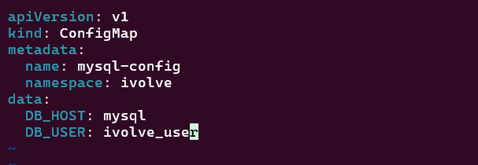
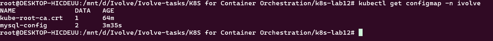
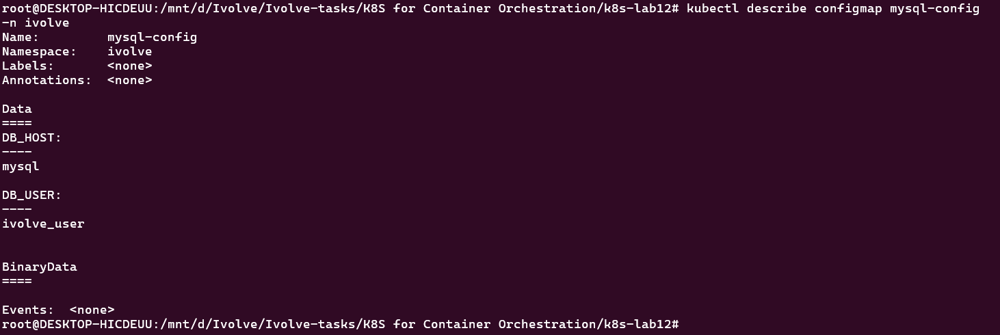
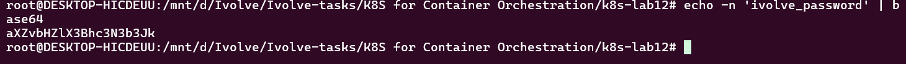
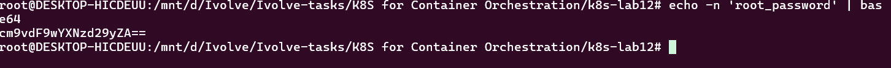
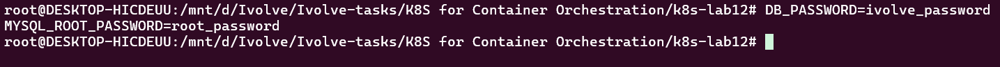
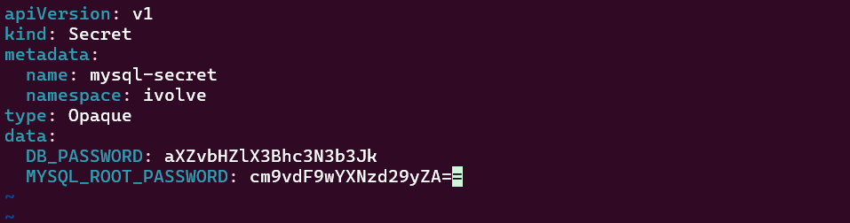
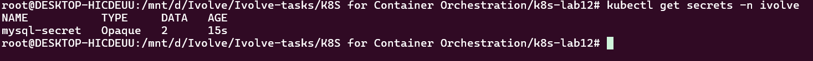
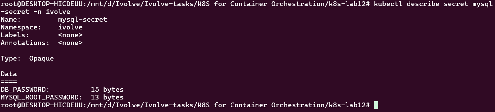

# Lab 12: Managing Configuration and Sensitive Data with ConfigMaps and Secrets

## Objective

In this lab, Kubernetes ConfigMaps and Secrets are used to manage application configuration and sensitive MySQL credentials.

The objectives of this lab are:

- Create a ConfigMap to store non-sensitive MySQL configuration.
- Store `DB_HOST` and `DB_USER` in the ConfigMap.
- Create a Secret to store sensitive MySQL credentials.
- Store `DB_PASSWORD` and `MYSQL_ROOT_PASSWORD` in the Secret.
- Encode Secret values using Base64.
- Verify the created ConfigMap and Secret resources.

---

## Prerequisites

- Kubernetes cluster running.
- `kubectl` installed and configured.
- `ivolve` namespace created.

Verify the namespace:

```bash
kubectl get namespace ivolve
```

---

## 1. ConfigMap

### What is a ConfigMap?

A ConfigMap is a Kubernetes resource used to store non-sensitive configuration data.

It allows application configuration to be separated from the application itself.

For this lab, the ConfigMap stores:

- `DB_HOST` – The hostname of the MySQL StatefulSet Service.
- `DB_USER` – The database user used by the application to connect to the `ivolve` database.

### ConfigMap File

The ConfigMap is defined in:

```text
configmap.yaml
```

### Configuration

```yaml
apiVersion: v1
kind: ConfigMap
metadata:
  name: mysql-config
  namespace: ivolve
data:
  DB_HOST: mysql
  DB_USER: ivolve_user
```

### Explanation

| Field | Description |
|---|---|
| `apiVersion` | Kubernetes API version |
| `kind` | Specifies that this resource is a ConfigMap |
| `name` | Name of the ConfigMap |
| `namespace` | Namespace where the ConfigMap is created |
| `DB_HOST` | Hostname of the MySQL Service |
| `DB_USER` | MySQL database username |

### Create the ConfigMap

The ConfigMap was created using:

```bash
kubectl apply -f configmap.yaml
```



### Verify the ConfigMap

To list ConfigMaps in the `ivolve` namespace:

```bash
kubectl get configmap -n ivolve
```



Detailed information about the ConfigMap can be displayed using:

```bash
kubectl describe configmap mysql-config -n ivolve
```



---

## 2. Kubernetes Secret

### What is a Secret?

A Secret is a Kubernetes resource designed to store sensitive information such as:

- Passwords
- Tokens
- API keys
- Authentication credentials

In this lab, the Secret stores MySQL credentials.

The following values are stored:

- `DB_PASSWORD` – Password for the application database user.
- `MYSQL_ROOT_PASSWORD` – Root password for the MySQL database.

---

## 3. Base64 Encoding

Kubernetes Secret data is represented using Base64 encoding.

For example, the application database password:

```text
ivolve_password
```

is encoded as:

```text
aXZvbHZlX3Bhc3N3b3Jk
```

The Base64 encoding was generated using:

```bash
echo -n 'ivolve_password' | base64
```



The MySQL root password:

```text
root_password
```

was encoded using:

```bash
echo -n 'root_password' | base64
```

Result:

```text
cm9vdF9wYXNzd29yZA==
```



The passwords used during the lab are shown below:



> **Important:** Base64 is an encoding mechanism, not encryption. Anyone who has access to the encoded value can decode it. In production environments, Kubernetes Secrets should be protected using proper RBAC and encryption-at-rest mechanisms.

---

## 4. Secret Configuration

The Secret is defined in:

```text
secret.yaml
```

### Configuration

```yaml
apiVersion: v1
kind: Secret
metadata:
  name: mysql-secret
  namespace: ivolve
type: Opaque
data:
  DB_PASSWORD: aXZvbHZlX3Bhc3N3b3Jk
  MYSQL_ROOT_PASSWORD: cm9vdF9wYXNzd29yZA==
```

### Explanation

| Field | Description |
|---|---|
| `apiVersion` | Kubernetes API version |
| `kind` | Specifies that this resource is a Secret |
| `name` | Name of the Secret |
| `namespace` | Namespace where the Secret is created |
| `type` | `Opaque` indicates a generic Secret |
| `DB_PASSWORD` | Base64-encoded application database password |
| `MYSQL_ROOT_PASSWORD` | Base64-encoded MySQL root password |

---

## 5. Create the Secret

The Secret was created using:

```bash
kubectl apply -f secret.yaml
```



---

## 6. Verify the Secret

To list the Secrets in the `ivolve` namespace:

```bash
kubectl get secrets -n ivolve
```



Detailed information about the Secret can be displayed using:

```bash
kubectl describe secret mysql-secret -n ivolve
```



The Secret contains two data entries:

```text
DB_PASSWORD
MYSQL_ROOT_PASSWORD
```

---

## 7. ConfigMap vs Secret

| ConfigMap | Secret |
|---|---|
| Stores non-sensitive configuration | Stores sensitive information |
| `DB_HOST` | `DB_PASSWORD` |
| `DB_USER` | `MYSQL_ROOT_PASSWORD` |
| Used for application configuration | Used for credentials and sensitive data |
| Values are stored as normal configuration data | Values are represented using Base64 |

---

## 8. Kubernetes Resources

After completing the lab, the `ivolve` namespace contains the following resources:

```text
ivolve
│
├── ConfigMap
│   └── mysql-config
│       ├── DB_HOST
│       └── DB_USER
│
└── Secret
    └── mysql-secret
        ├── DB_PASSWORD
        └── MYSQL_ROOT_PASSWORD
```

---

## 9. Verification Commands

### Check ConfigMaps

```bash
kubectl get configmap -n ivolve
```

### Describe ConfigMap

```bash
kubectl describe configmap mysql-config -n ivolve
```

### Check Secrets

```bash
kubectl get secrets -n ivolve
```

### Describe Secret

```bash
kubectl describe secret mysql-secret -n ivolve
```

### Decode a Secret value

For example:

```bash
kubectl get secret mysql-secret -n ivolve \
  -o jsonpath='{.data.DB_PASSWORD}' | base64 -d
```

This decodes the Base64 value back to the original password.

---

## 10. Project Structure

```text
.
├── configmap.yaml
├── screenshots
│   ├── create-configmap.png
│   ├── describe-configmap.png
│   ├── describe-secrets.png
│   ├── get-configmap.png
│   ├── get-secrets.png
│   ├── ivolve-base64.png
│   ├── passwords.png
│   ├── root-base64.png
│   └── secret.png
└── secret.yaml
```

---

## 11. Conclusion

In this lab, Kubernetes ConfigMaps and Secrets were used to separate application configuration from sensitive credentials.

The ConfigMap was used to store non-sensitive MySQL configuration:

```text
DB_HOST
DB_USER
```

The Secret was used to store sensitive MySQL credentials:

```text
DB_PASSWORD
MYSQL_ROOT_PASSWORD
```

The Secret values were encoded using Base64 before being stored in the Kubernetes manifest.

This approach allows applications to consume configuration and credentials from Kubernetes resources instead of hard-coding them directly into application configuration files.
