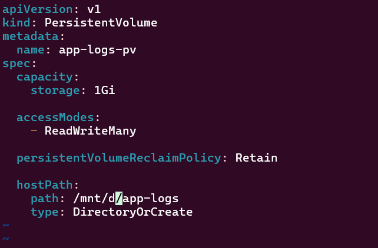
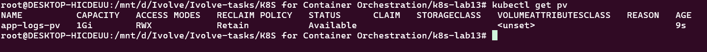
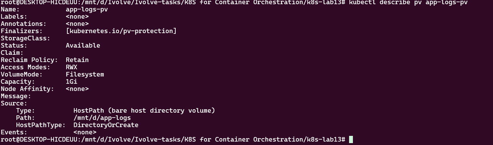
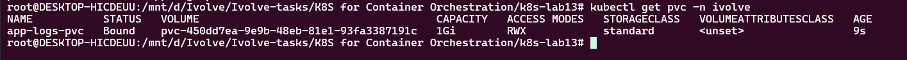
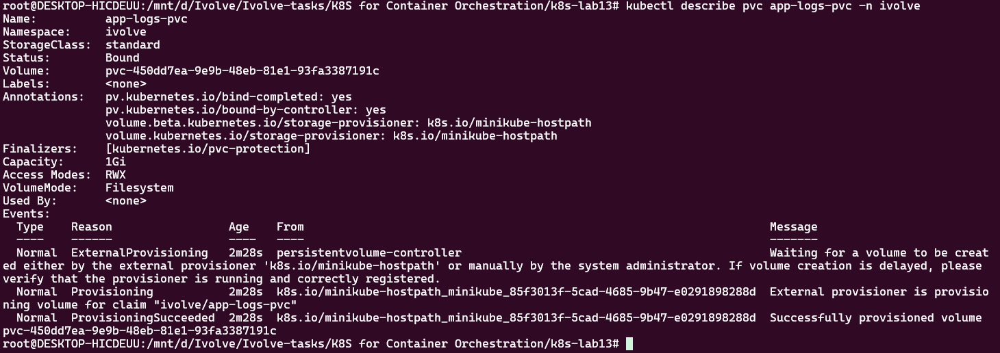

# Lab 13: Persistent Storage Setup for Application Logging

## Objective

In this lab, Kubernetes Persistent Volumes (PV) and Persistent Volume Claims (PVC) are configured to provide persistent storage for application logging.

The objectives of this lab are:

- Create a Persistent Volume (PV).
- Configure the PV with `1Gi` of storage.
- Use `hostPath` as the storage type.
- Use `/mnt/app-logs` as the storage path on the node.
- Configure `ReadWriteMany` access mode.
- Configure the reclaim policy as `Retain`.
- Create a Persistent Volume Claim (PVC).
- Request `1Gi` of storage through the PVC.
- Ensure the PVC access mode matches the PV.
- Verify that the PVC is successfully bound to the PV.

---

## Prerequisites

- Kubernetes cluster running.
- `kubectl` installed and configured.
- Minikube running.
- The `ivolve` namespace created.

Verify the cluster:

```bash
kubectl get nodes
```

Verify the namespace:

```bash
kubectl get namespace ivolve
```

---

## 1. Persistent Volume (PV)

### What is a Persistent Volume?

A Persistent Volume (PV) is a storage resource available in a Kubernetes cluster.

It allows applications to store data outside the temporary filesystem of a Pod.

For this lab, the PV uses a `hostPath` to store application logs on the Kubernetes node.

### PV Specifications

| Configuration | Value |
|---|---|
| Name | `app-logs-pv` |
| Storage | `1Gi` |
| Storage Type | `hostPath` |
| Path | `/mnt/app-logs` |
| Access Mode | `ReadWriteMany` |
| Reclaim Policy | `Retain` |

---

## 2. PV Configuration

The Persistent Volume is defined in:

```text
pv.yaml
```

The configuration is:

```yaml
apiVersion: v1
kind: PersistentVolume
metadata:
  name: app-logs-pv
spec:
  capacity:
    storage: 1Gi

  accessModes:
    - ReadWriteMany

  persistentVolumeReclaimPolicy: Retain

  hostPath:
    path: /mnt/app-logs
    type: DirectoryOrCreate
```



---

## 3. PV Configuration Explanation

### Storage

```yaml
capacity:
  storage: 1Gi
```

The Persistent Volume provides `1Gi` of storage.

### Access Mode

```yaml
accessModes:
  - ReadWriteMany
```

`ReadWriteMany`, also known as `RWX`, allows multiple Pods to mount the volume with read and write access.

### Reclaim Policy

```yaml
persistentVolumeReclaimPolicy: Retain
```

The `Retain` policy preserves the Persistent Volume and its underlying data when the associated PVC is deleted.

### HostPath

```yaml
hostPath:
  path: /mnt/app-logs
  type: DirectoryOrCreate
```

The PV uses `/mnt/app-logs` on the Kubernetes node as its storage location.

`DirectoryOrCreate` creates the directory if it does not already exist.

---

## 4. Create the Persistent Volume

The PV was created using:

```bash
kubectl apply -f pv.yaml
```

Verify the PV:

```bash
kubectl get pv
```



The expected result is similar to:

```text
NAME          CAPACITY   ACCESS MODES   RECLAIM POLICY   STATUS
app-logs-pv   1Gi        RWX            Retain            Available
```

---

## 5. Describe the Persistent Volume

Detailed information about the PV can be displayed using:

```bash
kubectl describe pv app-logs-pv
```

The output confirms:

```text
Capacity:       1Gi
Access Modes:   RWX
Reclaim Policy: Retain
Type:           HostPath
Path:           /mnt/app-logs
```



---

## 6. Persistent Volume Claim (PVC)

### What is a Persistent Volume Claim?

A Persistent Volume Claim (PVC) is a request for storage made by an application or user.

Instead of directly consuming a Persistent Volume, an application requests storage through a PVC.

Kubernetes then matches the PVC with an available PV that satisfies its requirements.

---

## 7. PVC Specifications

The PVC is defined in:

```text
pvc.yaml
```

The PVC requests:

| Configuration | Value |
|---|---|
| Name | `app-logs-pvc` |
| Namespace | `ivolve` |
| Storage Request | `1Gi` |
| Access Mode | `ReadWriteMany` |

---

## 8. PVC Configuration

```yaml
apiVersion: v1
kind: PersistentVolumeClaim
metadata:
  name: app-logs-pvc
  namespace: ivolve
spec:
  accessModes:
    - ReadWriteMany

  resources:
    requests:
      storage: 1Gi
```

---

## 9. Create the PVC

The PVC was created using:

```bash
kubectl apply -f pvc.yaml
```

Verify the PVC:

```bash
kubectl get pvc -n ivolve
```



The expected result is:

```text
NAME           STATUS   VOLUME        CAPACITY   ACCESS MODES
app-logs-pvc   Bound    app-logs-pv   1Gi        RWX
```

---

## 10. Verify the PVC

Detailed information about the PVC can be displayed using:

```bash
kubectl describe pvc app-logs-pvc -n ivolve
```

The output should confirm:

```text
Status:       Bound
Capacity:     1Gi
Access Modes: RWX
Volume:       app-logs-pv
```



---

## 11. PV and PVC Binding

The PV and PVC can be verified using:

```bash
kubectl get pv
```

and:

```bash
kubectl get pvc -n ivolve
```

The expected relationship is:

```text
Persistent Volume
       │
       │ 1Gi / RWX
       ▼
Persistent Volume Claim
       │
       ▼
     Bound
```

The PVC status should be:

```text
Bound
```

This confirms that Kubernetes successfully matched the PVC with the PV.

---

## 12. Accessing the HostPath

Because the PV uses `hostPath`, the `/mnt/app-logs` directory exists on the Kubernetes node.

To access the Minikube node:

```bash
minikube ssh
```

Then check the directory:

```bash
ls -ld /mnt/app-logs
```

To access the directory:

```bash
cd /mnt/app-logs
```

And list its contents:

```bash
ls -la
```

The directory is used as the storage location for application logs.

---

## 13. Access Mode

Both the PV and PVC use:

```text
ReadWriteMany
```

or:

```text
RWX
```

This allows multiple Pods to mount the volume with read and write access.

PV:

```yaml
accessModes:
  - ReadWriteMany
```

PVC:

```yaml
accessModes:
  - ReadWriteMany
```

Therefore, the access modes of the PV and PVC match.

---

## 14. Reclaim Policy

The PV uses:

```yaml
persistentVolumeReclaimPolicy: Retain
```

The `Retain` policy ensures that the PV and its underlying storage are preserved when the PVC is deleted.

This is useful for application logs because logs may be required later for troubleshooting, auditing, or analysis.

---

## 15. Verification Commands

### Check Nodes

```bash
kubectl get nodes
```

### Check Persistent Volumes

```bash
kubectl get pv
```

### Check Persistent Volume Claims

```bash
kubectl get pvc -n ivolve
```

### Describe PV

```bash
kubectl describe pv app-logs-pv
```

### Describe PVC

```bash
kubectl describe pvc app-logs-pvc -n ivolve
```

---

## 16. Expected Final State

The final configuration should look like:

```text
PV: app-logs-pv
│
├── Storage: 1Gi
├── Access Mode: RWX
├── Reclaim Policy: Retain
└── HostPath: /mnt/app-logs
        │
        │
        ▼
PVC: app-logs-pvc
│
├── Namespace: ivolve
├── Request: 1Gi
├── Access Mode: RWX
└── Status: Bound
```

---

## 17. Project Structure

```text
.
├── pv.yaml
├── pvc.yaml
└── screenshots
    ├── describe-pv.png
    ├── describe-pvc.png
    ├── get-pv.png
    ├── get-pvc.png
    └── pvyaml.png
```

---

## 18. Conclusion

In this lab, Kubernetes persistent storage was configured for application logging using a Persistent Volume and Persistent Volume Claim.

The Persistent Volume provides:

```text
Storage: 1Gi
Storage Type: hostPath
Path: /mnt/app-logs
Access Mode: ReadWriteMany
Reclaim Policy: Retain
```

The Persistent Volume Claim requests:

```text
Storage: 1Gi
Access Mode: ReadWriteMany
Namespace: ivolve
```

The PVC was successfully bound to the PV, providing persistent storage that can be used by applications to store log data.
