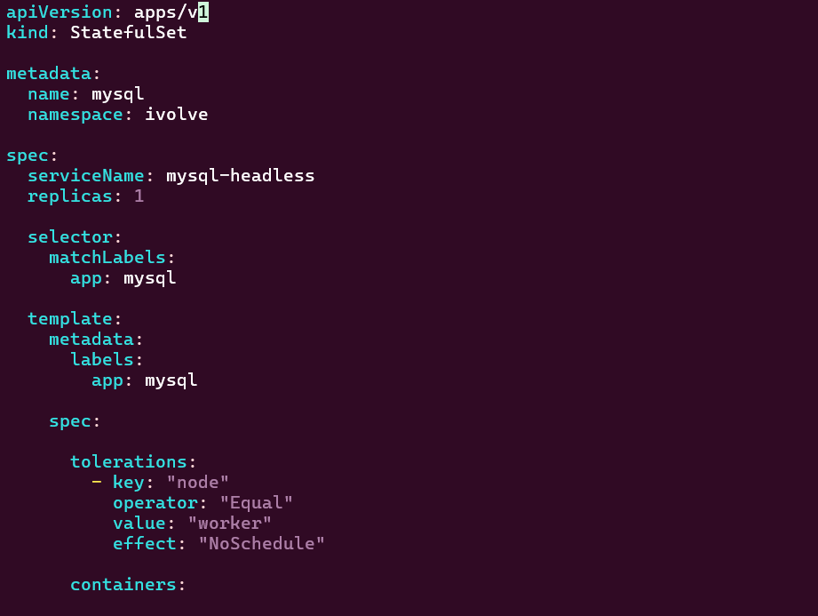
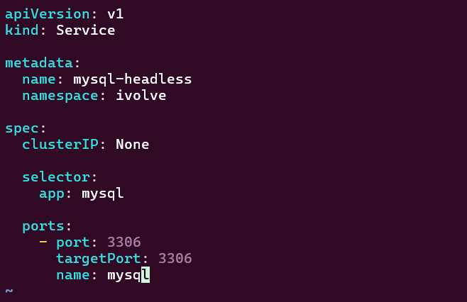
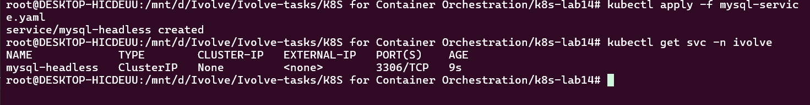
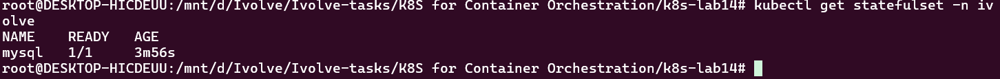
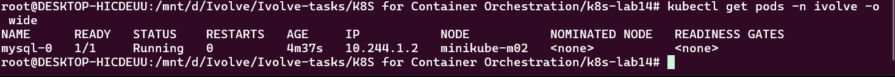
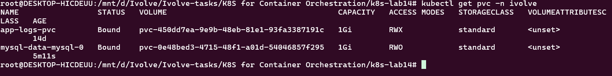
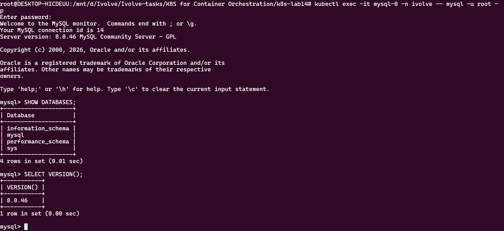

# Lab 14 – StatefulSet with Headless Service

## Objective

The objective of this lab is to deploy a MySQL database using a Kubernetes StatefulSet and expose it through a Headless Service.

The StatefulSet is configured with:

* 1 MySQL replica.
* MySQL root password consumed from a Kubernetes Secret.
* A toleration for the `node=worker:NoSchedule` taint.
* Persistent storage using a dynamically provisioned PersistentVolumeClaim (PVC).
* MySQL data mounted at `/var/lib/mysql`.
* A Headless Service with `clusterIP: None`.
* MySQL connectivity verified using the MySQL client.

---

## Project Structure

```text
k8s-lab14/
├── mysql-service.yaml
├── mysql-statefulset.yaml
└── screenshots/
    ├── get-pods.png
    ├── get-pvc.png
    ├── get-statefulset.png
    ├── get-svc.png
    ├── mysql-client.png
    ├── service.png
    └── statefulset-yaml.png
```

---

# 1. StatefulSet Configuration

The MySQL StatefulSet runs one MySQL pod and uses the `mysql-secret` Secret to provide the MySQL root password.

The pod also includes a toleration that allows it to run on a node with the following taint:

```text
node=worker:NoSchedule
```

Persistent storage is provided through a `volumeClaimTemplates` configuration.

### `mysql-statefulset.yaml`

```yaml
apiVersion: apps/v1
kind: StatefulSet

metadata:
  name: mysql
  namespace: ivolve

spec:
  serviceName: mysql-headless
  replicas: 1

  selector:
    matchLabels:
      app: mysql

  template:
    metadata:
      labels:
        app: mysql

    spec:

      tolerations:
        - key: "node"
          operator: "Equal"
          value: "worker"
          effect: "NoSchedule"

      containers:
        - name: mysql
          image: mysql:8.0

          ports:
            - containerPort: 3306
              name: mysql

          env:
            - name: MYSQL_ROOT_PASSWORD
              valueFrom:
                secretKeyRef:
                  name: mysql-secret
                  key: MYSQL_ROOT_PASSWORD

          volumeMounts:
            - name: mysql-data
              mountPath: /var/lib/mysql

  volumeClaimTemplates:
    - metadata:
        name: mysql-data

      spec:
        accessModes:
          - ReadWriteOnce

        resources:
          requests:
            storage: 1Gi
```

### Explanation

* `replicas: 1` creates a single MySQL pod.
* `serviceName: mysql-headless` associates the StatefulSet with the Headless Service.
* `secretKeyRef` retrieves the MySQL root password from `mysql-secret`.
* The toleration allows the pod to be scheduled on a node tainted with `node=worker:NoSchedule`.
* `volumeClaimTemplates` automatically creates a PVC for the StatefulSet pod.
* MySQL persistent data is mounted at:

```text
/var/lib/mysql
```

### Screenshot



---

# 2. Headless Service

A Headless Service was created to provide network identity and DNS-based discovery for the MySQL StatefulSet.

### `mysql-service.yaml`

```yaml
apiVersion: v1
kind: Service

metadata:
  name: mysql-headless
  namespace: ivolve

spec:
  clusterIP: None

  selector:
    app: mysql

  ports:
    - port: 3306
      targetPort: 3306
      name: mysql
```

The important configuration is:

```yaml
clusterIP: None
```

This makes the Service Headless and allows Kubernetes to provide direct DNS records for the StatefulSet pods.

For example, the MySQL pod can be addressed using:

```text
mysql-0.mysql-headless.ivolve.svc.cluster.local
```

### Screenshot



---

# 3. Apply the Headless Service

The Service was created using:

```bash
kubectl apply -f mysql-service.yaml
```

The Service was then verified using:

```bash
kubectl get svc -n ivolve
```

The `CLUSTER-IP` should be:

```text
None
```

### Screenshot



---

# 4. Deploy the StatefulSet

The StatefulSet was deployed using:

```bash
kubectl apply -f mysql-statefulset.yaml
```

The StatefulSet was verified using:

```bash
kubectl get statefulset -n ivolve
```

The expected result is:

```text
NAME    READY
mysql   1/1
```

### Screenshot



---

# 5. Verify the MySQL Pod

The running pod was checked using:

```bash
kubectl get pods -n ivolve -o wide
```

The expected pod is:

```text
mysql-0
```

with:

```text
READY   1/1
STATUS  Running
```

The pod was scheduled on the Kubernetes cluster and successfully started the MySQL container.

### Screenshot



---

# 6. Verify Persistent Storage

The StatefulSet automatically created a PVC from the `volumeClaimTemplates`.

The PVC was checked using:

```bash
kubectl get pvc -n ivolve
```

The MySQL PVC should show:

```text
STATUS   Bound
CAPACITY 1Gi
ACCESS MODES RWO
```

The generated PVC follows the StatefulSet naming convention:

```text
mysql-data-mysql-0
```

### Screenshot



---

# 7. MySQL Client Connection

The MySQL database was tested by connecting directly to the MySQL pod using the MySQL client:

```bash
kubectl exec -it mysql-0 -n ivolve -- mysql -u root -p
```

The root password configured in the `mysql-secret` Secret was entered when prompted.

After connecting successfully, the following commands were executed:

```sql
SHOW DATABASES;
```

and:

```sql
SELECT VERSION();
```

This confirms that the MySQL database is operational and accepting client connections.

### Screenshot



---

# 8. Verification Summary

The following components were successfully configured and verified:

| Requirement                            | Status |
| -------------------------------------- | ------ |
| MySQL StatefulSet                      | ✅      |
| 1 Replica                              | ✅      |
| MySQL 8.0                              | ✅      |
| Root password from Secret              | ✅      |
| Toleration `node=worker:NoSchedule`    | ✅      |
| PersistentVolumeClaim                  | ✅      |
| 1Gi Persistent Storage                 | ✅      |
| MySQL data mounted at `/var/lib/mysql` | ✅      |
| Headless Service                       | ✅      |
| `clusterIP: None`                      | ✅      |
| MySQL Client Connection                | ✅      |

---

# Conclusion

In this lab, a MySQL database was deployed using a Kubernetes StatefulSet with persistent storage and Secret-based configuration.

A Headless Service was created to provide stable network identity and DNS discovery for the StatefulSet pod. The MySQL root password was securely provided through a Kubernetes Secret, while a PVC ensured that MySQL data was stored persistently.

Finally, the MySQL client was used to connect to the database and verify that the MySQL server was operational.

