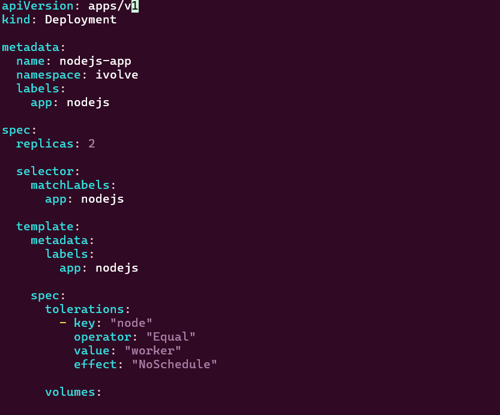
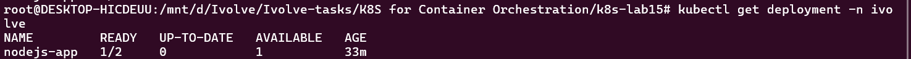
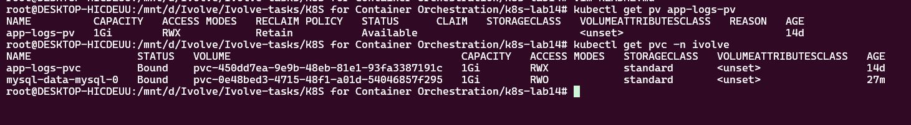
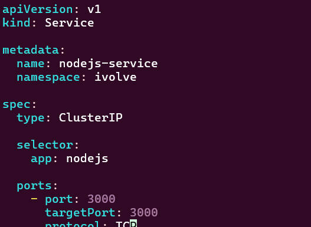
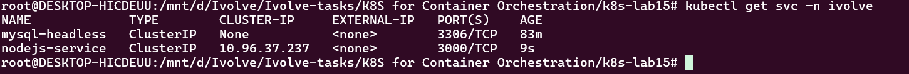
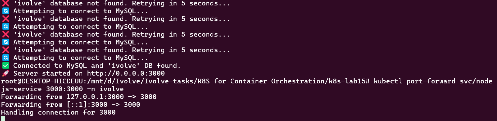
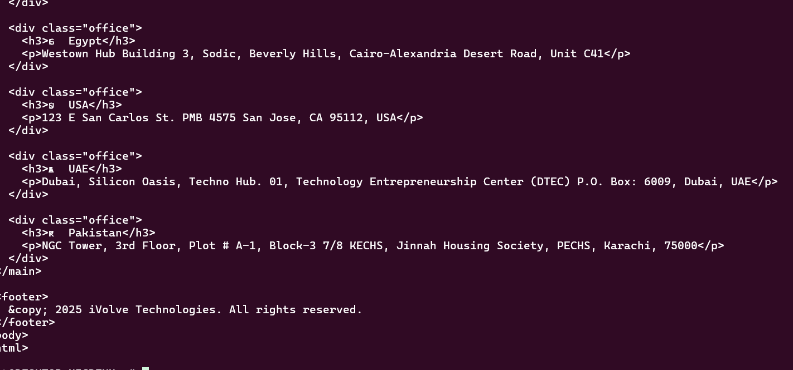

# Lab 15: Node.js Application Deployment

## Objective

Deploy a Node.js application on Kubernetes using:

* A custom Docker image from Docker Hub
* ConfigMap and Secret for environment variables
* PersistentVolumeClaim for application logs
* Toleration for the worker node
* ClusterIP Service for application access

---

## 1. Node.js Deployment

A Kubernetes Deployment named `nodejs-app` was created with **2 replicas** using the custom Docker image:

```text
moamenothman1/nodejs-app:v1
```

The Deployment includes:

* ConfigMap variables: `DB_HOST`, `DB_USER`
* Secret variable: `DB_PASSWORD`
* Toleration for `node=worker:NoSchedule`
* PVC `app-logs-pvc`
* Container port `3000`

### Deployment Configuration



### Deployment Status



> The Deployment is configured with 2 replicas. Only one Node.js pod is running because the `ivolve` namespace has a Pod ResourceQuota of 2, while the MySQL StatefulSet already uses one pod.

---

## 2. Persistent Storage

The Node.js application uses the existing `app-logs-pvc` PersistentVolumeClaim created in the previous lab.

The PVC is mounted inside the container at:

```text
/app/logs
```

### PV and PVC Status



---

## 3. MySQL Service

A MySQL Service named `mysql` was created to allow the Node.js application to connect to MySQL using:

```text
DB_HOST=mysql
```

The Service points to the MySQL StatefulSet.

---

## 4. Node.js Service

A ClusterIP Service named `nodejs-service` was created to expose the Node.js application on port `3000`.

### Service Configuration



The Service uses the following selector:

```text
app=nodejs
```

and forwards traffic from:

```text
Port: 3000
TargetPort: 3000
```

### Service Status



---

## 5. Application Testing

The application was tested by forwarding the Kubernetes Service to the local machine:

```bash
kubectl port-forward svc/nodejs-service 3000:3000 -n ivolve
```

### Port Forward



The application was then accessed using:

```bash
curl http://localhost:3000
```

### Application Response



The successful response confirms that:

* The Node.js pod is running.
* The application successfully connects to MySQL.
* The `ivolve` database is available.
* The ClusterIP Service correctly routes traffic to the Node.js application.

---

## 6. Verification Commands

```bash
kubectl get deployment -n ivolve
kubectl get pods -n ivolve -o wide
kubectl get pvc -n ivolve
kubectl get svc -n ivolve
kubectl get endpoints nodejs-service -n ivolve
```

To test the application:

```bash
kubectl port-forward svc/nodejs-service 3000:3000 -n ivolve
```

Then:

```bash
curl http://localhost:3000
```

---

## Result

The Node.js application was successfully deployed and exposed through a Kubernetes ClusterIP Service.

### Completed Requirements

* [x] Node.js Deployment created
* [x] Custom Docker image configured
* [x] 2 replicas configured
* [x] ConfigMap used for environment variables
* [x] Secret used for database password
* [x] Worker node toleration configured
* [x] Persistent storage configured
* [x] ClusterIP Service created
* [x] MySQL connectivity verified
* [x] Application tested successfully using `curl`

