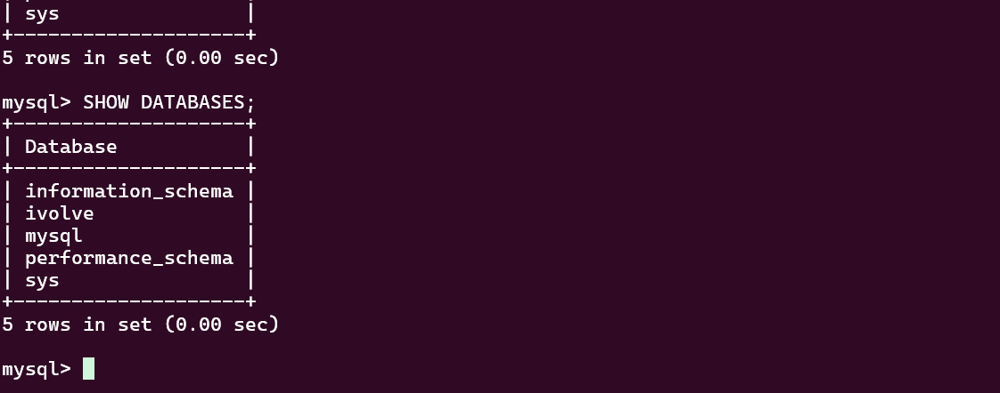

# Lab 16 – Kubernetes Init Container for Pre-Deployment Database Setup

## 📌 Overview

In this lab, an **Init Container** was added to the existing Node.js Kubernetes Deployment to perform database initialization before the main application container starts.

The Init Container is responsible for waiting until MySQL is ready, creating the required database and database user, and granting the required privileges.

The main Node.js application container starts only after the Init Container completes successfully.

---

# 🎯 Objectives

The main objectives of this lab are:

* Add an Init Container to the existing Node.js Deployment.
* Use the `mysql:5.7` image for the Init Container.
* Wait for MySQL to become ready before performing database operations.
* Create the `ivolve` database.
* Create the `ivolve_user` database user.
* Grant full privileges on the `ivolve` database.
* Use Kubernetes ConfigMap and Secret for database configuration.
* Verify the database and user configuration.
* Verify that the Node.js application starts successfully after initialization.

---

# 🧠 What is an Init Container?

An **Init Container** is a special Kubernetes container that runs before the application's main containers.

A Pod can have one or more Init Containers. Kubernetes runs them sequentially, and each Init Container must complete successfully before the next one starts.

The main application containers are started only after all Init Containers have completed successfully.

In this lab, the startup sequence is:

```text
┌─────────────────────────────┐
│       Node.js Pod           │
│                             │
│  ┌───────────────────────┐  │
│  │ Init Container        │  │
│  │       db-init         │  │
│  │                       │  │
│  │  1. Wait for MySQL    │  │
│  │  2. Create DB         │  │
│  │  3. Create User       │  │
│  │  4. Grant Privileges  │  │
│  └───────────┬───────────┘  │
│              │               │
│              ▼               │
│       Initialization         │
│          Complete             │
│              │               │
│              ▼               │
│  ┌───────────────────────┐  │
│  │ Main Container        │  │
│  │      nodejs-app       │  │
│  └───────────────────────┘  │
└─────────────────────────────┘
```

This prevents the Node.js application from starting before its required database configuration is ready.

---

# 📁 Project Structure

```text
k8s-lab16/
├── nodejs_deployment.yaml
└── screenshots/
    ├── nodejs_deployment_yaml.png
    └── sql_check.png
```

---

# 🔧 Existing Resources

This lab uses resources created in previous labs.

The existing MySQL deployment consists of:

```text
MySQL StatefulSet
       │
       ├── mysql-0
       │
       ├── mysql Service
       │
       └── mysql-headless Service
```

The Node.js application uses the following existing Kubernetes resources:

### ConfigMap

```text
mysql-config
```

The ConfigMap provides:

```text
DB_HOST
DB_USER
```

### Secret

```text
mysql-secret
```

The Secret provides:

```text
DB_PASSWORD
MYSQL_ROOT_PASSWORD
```

The credentials are not stored directly in the Deployment manifest.

---

# 1️⃣ Create the Node.js Deployment Configuration

The existing Node.js Deployment was modified to include the Init Container.

The complete `nodejs_deployment.yaml` file is shown below.

## `nodejs_deployment.yaml`

```yaml
apiVersion: apps/v1
kind: Deployment

metadata:
  name: nodejs-app
  namespace: ivolve

spec:
  replicas: 1

  strategy:
    type: Recreate

  selector:
    matchLabels:
      app: nodejs-app

  template:
    metadata:
      labels:
        app: nodejs-app

    spec:

      # ==========================================
      # Init Container
      # ==========================================
      initContainers:

        - name: db-init
          image: mysql:5.7

          env:

            # Database Host
            - name: DB_HOST
              valueFrom:
                configMapKeyRef:
                  name: mysql-config
                  key: DB_HOST

            # Application Database User
            - name: DB_USER
              valueFrom:
                configMapKeyRef:
                  name: mysql-config
                  key: DB_USER

            # Application Database Password
            - name: DB_PASSWORD
              valueFrom:
                secretKeyRef:
                  name: mysql-secret
                  key: DB_PASSWORD

            # MySQL Root Password
            - name: MYSQL_ROOT_PASSWORD
              valueFrom:
                secretKeyRef:
                  name: mysql-secret
                  key: MYSQL_ROOT_PASSWORD

          command:

            - /bin/sh
            - -c

            - |
              echo "Waiting for MySQL..."

              until mysqladmin ping \
                -h"$DB_HOST" \
                -uroot \
                -p"$MYSQL_ROOT_PASSWORD" \
                --silent
              do
                sleep 3
              done

              echo "MySQL is ready."

              mysql \
                -h"$DB_HOST" \
                -uroot \
                -p"$MYSQL_ROOT_PASSWORD" \
                -e "
                  CREATE DATABASE IF NOT EXISTS ivolve;

                  CREATE USER IF NOT EXISTS
                  '$DB_USER'@'%' IDENTIFIED BY '$DB_PASSWORD';

                  GRANT ALL PRIVILEGES
                  ON ivolve.* TO '$DB_USER'@'%';

                  FLUSH PRIVILEGES;
                "

              echo "Database ivolve and user $DB_USER configured successfully."

      # ==========================================
      # Main Application Container
      # ==========================================
      containers:

        - name: nodejs-app
          image: moamenothan1/nodejs-app:v1

          ports:
            - containerPort: 3000

          env:

            - name: DB_HOST
              valueFrom:
                configMapKeyRef:
                  name: mysql-config
                  key: DB_HOST

            - name: DB_USER
              valueFrom:
                configMapKeyRef:
                  name: mysql-config
                  key: DB_USER

            - name: DB_PASSWORD
              valueFrom:
                secretKeyRef:
                  name: mysql-secret
                  key: DB_PASSWORD

          volumeMounts:

            - name: app-logs
              mountPath: /app/logs

      volumes:

        - name: app-logs
          persistentVolumeClaim:
            claimName: app-logs-pvc

      tolerations:

        - key: node
          operator: Equal
          value: worker
          effect: NoSchedule
```

---

# 2️⃣ Understanding the Deployment

## Deployment

```yaml
apiVersion: apps/v1
kind: Deployment
```

The resource is a Kubernetes Deployment using the `apps/v1` API.

The Deployment manages the Node.js application Pod.

---

## Namespace

```yaml
metadata:
  name: nodejs-app
  namespace: ivolve
```

The Deployment is created inside the `ivolve` namespace.

---

## Replicas

```yaml
replicas: 1
```

Only one Node.js Pod is required.

This is also important because the existing ResourceQuota in the namespace allows a limited number of Pods.

The MySQL Pod already consumes one Pod slot, so the Node.js application runs with one replica.

---

# 3️⃣ Init Container Configuration

The most important part of the Deployment is:

```yaml
initContainers:
  - name: db-init
    image: mysql:5.7
```

The Init Container is called:

```text
db-init
```

and uses:

```text
mysql:5.7
```

The MySQL image contains the MySQL client utilities required to connect to the database.

---

# 4️⃣ Database Environment Variables

The Init Container receives its configuration using environment variables.

### DB_HOST

```yaml
- name: DB_HOST
  valueFrom:
    configMapKeyRef:
      name: mysql-config
      key: DB_HOST
```

This retrieves the MySQL service hostname from the ConfigMap.

---

### DB_USER

```yaml
- name: DB_USER
  valueFrom:
    configMapKeyRef:
      name: mysql-config
      key: DB_USER
```

This retrieves the application database username.

---

### DB_PASSWORD

```yaml
- name: DB_PASSWORD
  valueFrom:
    secretKeyRef:
      name: mysql-secret
      key: DB_PASSWORD
```

The application database password is retrieved securely from the Kubernetes Secret.

---

### MYSQL_ROOT_PASSWORD

```yaml
- name: MYSQL_ROOT_PASSWORD
  valueFrom:
    secretKeyRef:
      name: mysql-secret
      key: MYSQL_ROOT_PASSWORD
```

The MySQL root password is required by the Init Container to perform database initialization.

---

# 5️⃣ Wait for MySQL

The Init Container executes:

```bash
echo "Waiting for MySQL..."

until mysqladmin ping \
  -h"$DB_HOST" \
  -uroot \
  -p"$MYSQL_ROOT_PASSWORD" \
  --silent
do
  sleep 3
done

echo "MySQL is ready."
```

### How it works

The command continuously checks the MySQL server.

If MySQL is unavailable:

```text
mysqladmin ping
      │
      ▼
 MySQL not ready
      │
      ▼
   sleep 3
      │
      ▼
 Try again
```

When MySQL becomes ready:

```text
mysqladmin ping
      │
      ▼
 MySQL ready
      │
      ▼
Continue database initialization
```

This avoids trying to execute SQL commands before the MySQL server is available.

---

# 6️⃣ Create the Database

Once MySQL is ready, the Init Container executes:

```sql
CREATE DATABASE IF NOT EXISTS ivolve;
```

This creates:

```text
ivolve
```

The `IF NOT EXISTS` condition means the command does not fail if the database already exists.

---

# 7️⃣ Create the Database User

The Init Container executes:

```sql
CREATE USER IF NOT EXISTS
'ivolve_user'@'%' IDENTIFIED BY '$DB_PASSWORD';
```

This creates:

```text
Username: ivolve_user
Host:     %
```

The `%` allows the MySQL account to connect from different hosts, subject to the MySQL and Kubernetes networking configuration.

---

# 8️⃣ Grant Privileges

The user receives full privileges on the application database:

```sql
GRANT ALL PRIVILEGES
ON ivolve.* TO 'ivolve_user'@'%';
```

This gives `ivolve_user` the required privileges on:

```text
ivolve.*
```

Finally:

```sql
FLUSH PRIVILEGES;
```

is executed.

---

# 9️⃣ Apply the Deployment

The Deployment was applied using:

```bash
kubectl apply -f nodejs_deployment.yaml
```

Expected output:

```text
deployment.apps/nodejs-app configured
```

---

# 🔟 Verify the Pod

The Pods were monitored using:

```bash
kubectl get pods -n ivolve -w
```

The final result was:

```text
NAME                          READY   STATUS    RESTARTS   AGE
mysql-0                       1/1     Running   1          21d
nodejs-app-6565676668-lppwd   1/1     Running   0          74s
```

The Node.js Pod reached:

```text
1/1 Running
```

This confirms that the Init Container completed and the main Node.js container started successfully.

---

# 1️⃣1️⃣ Verify the Init Container Logs

The Init Container logs can be viewed using:

```bash
kubectl logs -n ivolve nodejs-app-6565676668-lppwd -c db-init
```

The successful output was:

```text
Waiting for MySQL...
MySQL is ready.
Database ivolve and user ivolve_user configured successfully.
```

This confirms that the Init Container:

1. Started successfully.
2. Waited for MySQL.
3. Detected that MySQL was ready.
4. Created/configured the database.
5. Created/configured the application user.
6. Completed successfully.

---

# 1️⃣2️⃣ Connect to MySQL

The MySQL Pod can be accessed using:

```bash
kubectl exec -it mysql-0 -n ivolve -- mysql -uroot -p
```

After executing the command, MySQL asks for the root password.

The password is stored in the existing Kubernetes Secret:

```text
mysql-secret
```

It can be retrieved when needed using:

```bash
kubectl get secret mysql-secret -n ivolve \
  -o jsonpath='{.data.MYSQL_ROOT_PASSWORD}' | base64 -d
echo
```

---

# 1️⃣3️⃣ Verify the Database

Inside the MySQL shell:

```sql
SHOW DATABASES;
```

The expected result includes:

```text
ivolve
```

This confirms that the Init Container successfully created the database.

---

# 1️⃣4️⃣ Verify the Database User

Run:

```sql
SELECT User, Host
FROM mysql.user
WHERE User = 'ivolve_user';
```

Expected result:

```text
ivolve_user    %
```

This confirms that the application user was created successfully.

---

# 1️⃣5️⃣ Verify Database Privileges

Run:

```sql
SHOW GRANTS FOR 'ivolve_user'@'%';
```

The result should include:

```text
GRANT ALL PRIVILEGES ON `ivolve`.* TO 'ivolve_user'@'%'
```

This confirms that the application user has full privileges on the `ivolve` database.

### 📸 SQL Verification



---

# 🔄 Complete Workflow

The complete process can be summarized as:

```text
kubectl apply
      │
      ▼
Deployment created/updated
      │
      ▼
Node.js Pod starts
      │
      ▼
db-init Init Container starts
      │
      ▼
Check MySQL availability
      │
      ├── Not Ready ──► Wait 3 seconds
      │                      │
      │                      └──────► Check again
      │
      ▼
MySQL Ready
      │
      ▼
Create ivolve database
      │
      ▼
Create ivolve_user
      │
      ▼
Grant privileges
      │
      ▼
Init Container com
```

