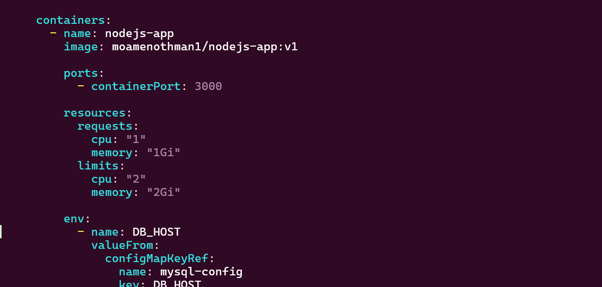
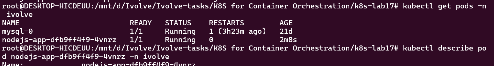
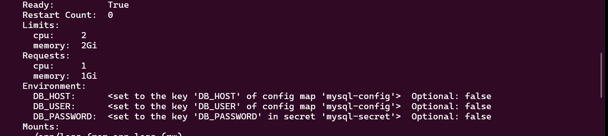
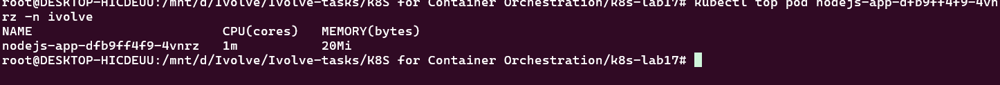

# Lab 17: Pod Resource Management with CPU and Memory Requests and Limits

## Overview

In this lab, the existing Node.js application Deployment is updated to define **CPU and Memory Requests and Limits** for the main application container.

Kubernetes uses resource requests and limits to control how much CPU and memory a container is expected to need and how much it is allowed to consume.

The Node.js application is configured with:

* **CPU Request:** `1` CPU
* **Memory Request:** `1Gi`
* **CPU Limit:** `2` CPUs
* **Memory Limit:** `2Gi`

The configuration is then verified using `kubectl describe pod`, and real-time resource consumption is monitored using `kubectl top pod`.

---

## Objectives

The main objectives of this lab are:

* Configure CPU and Memory requests for a Kubernetes container.
* Configure CPU and Memory limits.
* Understand the difference between requests and limits.
* Apply the updated Node.js Deployment.
* Verify the configured resources using `kubectl describe pod`.
* Monitor real-time CPU and Memory usage using `kubectl top pod`.

---

## Lab Environment

* Kubernetes
* Minikube
* Namespace: `ivolve`
* Deployment: `nodejs-app`
* Container: `nodejs-app`
* Application Image: `moamenothan1/nodejs-app:v1`

---

# 1. Project Structure

The Lab 17 directory contains the following files:

```text
.
├── nodejs_deployment.yaml
└── screenshots
    ├── describe_pod.png
    ├── get_pods.png
    ├── realtime.png
    └── resources_in_yaml.png
```

---

# 2. Resource Requests and Limits

Kubernetes allows resources to be configured using two main concepts:

### Requests

A **request** specifies the amount of CPU and memory that Kubernetes should reserve for the container when scheduling the Pod.

For this lab:

```yaml
requests:
  cpu: "1"
  memory: "1Gi"
```

This means the Node.js container requests:

* 1 CPU
* 1 GiB of memory

The Kubernetes scheduler uses these values when deciding where the Pod can be scheduled.

### Limits

A **limit** defines the maximum amount of a resource that the container can consume.

For this lab:

```yaml
limits:
  cpu: "2"
  memory: "2Gi"
```

This means the container can use up to:

* 2 CPUs
* 2 GiB of memory

---

# 3. Node.js Deployment Configuration

The following is the complete Deployment configuration used in this lab:

```yaml
apiVersion: apps/v1
kind: Deployment

metadata:
  name: nodejs-app
  namespace: ivolve

spec:
  replicas: 1

  strategy:
    type: Recreate

  selector:
    matchLabels:
      app: nodejs-app

  template:
    metadata:
      labels:
        app: nodejs-app
        lab: lab16

    spec:

      initContainers:
        - name: db-init
          image: mysql:5.7

          env:
            - name: DB_HOST
              valueFrom:
                configMapKeyRef:
                  name: mysql-config
                  key: DB_HOST

            - name: DB_USER
              valueFrom:
                configMapKeyRef:
                  name: mysql-config
                  key: DB_USER

            - name: DB_PASSWORD
              valueFrom:
                secretKeyRef:
                  name: mysql-secret
                  key: DB_PASSWORD

            - name: MYSQL_ROOT_PASSWORD
              valueFrom:
                secretKeyRef:
                  name: mysql-secret
                  key: MYSQL_ROOT_PASSWORD

          command:
            - /bin/sh
            - -c
            - |
              echo "Waiting for MySQL..."

              until mysqladmin ping \
                -h"$DB_HOST" \
                -uroot \
                -p"$MYSQL_ROOT_PASSWORD" \
                --silent
              do
                sleep 3
              done

              echo "MySQL is ready."

              mysql \
                -h"$DB_HOST" \
                -uroot \
                -p"$MYSQL_ROOT_PASSWORD" \
                -e "
                  CREATE DATABASE IF NOT EXISTS ivolve;

                  CREATE USER IF NOT EXISTS
                  '$DB_USER'@'%' IDENTIFIED BY '$DB_PASSWORD';

                  GRANT ALL PRIVILEGES
                  ON ivolve.* TO '$DB_USER'@'%';

                  FLUSH PRIVILEGES;
                "

              echo "Database ivolve and user $DB_USER configured successfully."

      containers:
        - name: nodejs-app
          image: moamenothan1/nodejs-app:v1

          ports:
            - containerPort: 3000

          env:
            - name: DB_HOST
              valueFrom:
                configMapKeyRef:
                  name: mysql-config
                  key: DB_HOST

            - name: DB_USER
              valueFrom:
                configMapKeyRef:
                  name: mysql-config
                  key: DB_USER

            - name: DB_PASSWORD
              valueFrom:
                secretKeyRef:
                  name: mysql-secret
                  key: DB_PASSWORD

          resources:
            requests:
              cpu: "1"
              memory: "1Gi"

            limits:
              cpu: "2"
              memory: "2Gi"

          volumeMounts:
            - name: app-logs
              mountPath: /app/logs

      volumes:
        - name: app-logs
          persistentVolumeClaim:
            claimName: app-logs-pvc

      tolerations:
        - key: "node"
          operator: "Equal"
          value: "worker"
          effect: "NoSchedule"
```



---

# 4. Understanding the Resource Configuration

The important section added for Lab 17 is:

```yaml
resources:
  requests:
    cpu: "1"
    memory: "1Gi"

  limits:
    cpu: "2"
    memory: "2Gi"
```

This section is located under the main `nodejs-app` container:

```yaml
containers:
  - name: nodejs-app
```

It is important that the resources are configured for the **application container**.

The `db-init` container is an Init Container and does not have the resource configuration required by this lab.

---

# 5. Apply the Updated Deployment

After updating the Deployment YAML file, apply the configuration using:

```bash
kubectl apply -f nodejs_deployment.yaml
```

Kubernetes updates the existing Deployment and recreates the Node.js Pod with the new resource configuration.

---

# 6. Verify the Pod

Check the Pods in the `ivolve` namespace:

```bash
kubectl get pods -n ivolve
```

Expected result:

```text
NAME                         READY   STATUS    RESTARTS   AGE
mysql-0                      1/1     Running   0          ...
nodejs-app-xxxxxxxxxx-xxxxx  1/1     Running   0          ...
```



The Node.js Pod should be in the:

```text
Running
```

state and should show:

```text
1/1
```

which means that the main application container is ready.

---

# 7. Verify Requests and Limits

To verify that Kubernetes applied the configured resources, use:

```bash
kubectl describe pod nodejs-app-dfb9ff4f9-4vnrz -n ivolve
```

Inside the output, the `nodejs-app` container should show:

```text
Requests:
  cpu:     1
  memory:  1Gi

Limits:
  cpu:     2
  memory:  2Gi
```



This confirms that Kubernetes applied the requested CPU and Memory resources to the Node.js container.

> **Note:** If the Pod is recreated later, its name will change. In that case, first run `kubectl get pods -n ivolve` and use the current Node.js Pod name with `kubectl describe pod`.

---

# 8. Monitor Real-Time Resource Usage

Kubernetes provides the `kubectl top` command to monitor the current CPU and Memory usage of Pods.

Run:

```bash
kubectl top pod nodejs-app-dfb9ff4f9-4vnrz -n ivolve
```

Example output:

```text
NAME                         CPU(cores)   MEMORY(bytes)
nodejs-app-dfb9ff4f9-4vnrz   1m           20Mi
```



The output shows the **actual current resource consumption** of the Pod.

For example:

```text
CPU:    1m
Memory: 20Mi
```

means that the Pod is currently using approximately:

* `1m` CPU
* `20Mi` Memory

---

# 9. Requests/Limits vs Actual Usage

It is important to distinguish between the configured resources and the actual resource consumption.

### Configured resources

```text
Request:
CPU:    1
Memory: 1Gi

Limit:
CPU:    2
Memory: 2Gi
```

### Current usage

Example:

```text
CPU:    1m
Memory: 20Mi
```

The Pod does **not** continuously consume its entire request or limit.

The request is used by the Kubernetes scheduler when placing the Pod, while the limit defines the maximum resource consumption allowed for the container.

Therefore, it is completely normal for a container configured with:

```text
CPU request: 1
Memory request: 1Gi
```

to currently use only:

```text
CPU: 1m
Memory: 20Mi
```

---

# 10. Why Resource Management Is Important

Resource requests and limits help Kubernetes manage workloads efficiently.

### CPU Requests

CPU requests help the scheduler determine whether a node has enough CPU capacity for the Pod.

### Memory Requests

Memory requests help Kubernetes determine whether enough memory is available on the node.

### CPU Limits

CPU limits prevent the container from consuming more CPU than the configured maximum.

### Memory Limits

Memory limits prevent the container from consuming more memory than the configured maximum.

If a container exceeds its memory limit, Kubernetes can terminate the container due to an out-of-memory condition.

---

# 11. Lab Workflow

The workflow implemented in this lab is:

```text
nodejs_deployment.yaml
        |
        v
CPU / Memory Requests
        +
CPU / Memory Limits
        |
        v
kubectl apply
        |
        v
Node.js Pod
        |
        +----------------------+
        |                      |
        v                      v
kubectl describe pod     kubectl top pod
        |                      |
        v                      v
Verify configured        Monitor actual
resources                resource usage
```

---

# 12. Verification Commands

### Check Pods

```bash
kubectl get pods -n ivolve
```

### Check resource configuration

```bash
kubectl describe pod nodejs-app-dfb9ff4f9-4vnrz -n ivolve
```

### Check real-time usage

```bash
kubectl top pod nodejs-app-dfb9ff4f9-4vnrz -n ivolve
```

---

# 13. Key Concepts Learned

Through this lab, the following Kubernetes concepts were practiced:

* CPU requests
* CPU limits
* Memory requests
* Memory limits
* Kubernetes scheduling
* Container resource management
* `kubectl describe pod`
* `kubectl top pod`
* Metrics Server
* Monitoring actual Pod resource consumption

---

# 14. Result

Lab 17 was successfully completed.

The Node.js Deployment was configured with:

```text
CPU Request:       1
Memory Request:    1Gi

CPU Limit:         2
Memory Limit:      2Gi
```

The configuration was verified using:

```bash
kubectl describe pod
```

Real-time CPU and Memory consumption was also successfully monitored using:

```bash
kubectl top pod
```

Example observed usage:

```text
CPU:    1m
Memory: 20Mi
```

This demonstrates the difference between **configured resource requests/limits** and **actual runtime resource consumption**.

