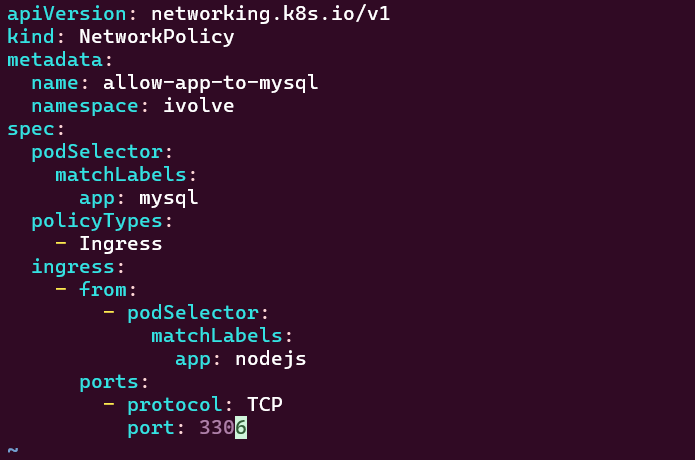
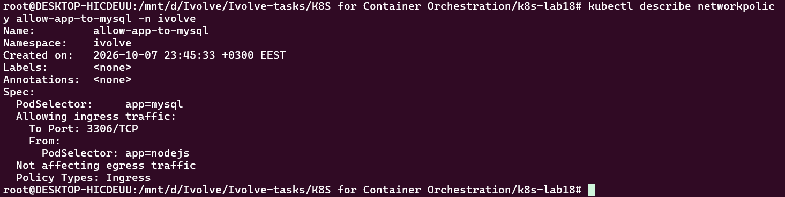
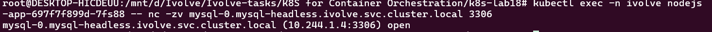

# Lab 18: Control Pod-to-Pod Traffic via Network Policy

## Objective

Restrict access to the MySQL pod so that only the Node.js application pods can reach it, and only on TCP port `3306`.

## NetworkPolicy

The NetworkPolicy targets pods with the label `app=mysql` and allows ingress traffic only from pods with the label `app=nodejs` on port `3306`.

### `networkpolicy.yaml`

```yaml
apiVersion: networking.k8s.io/v1
kind: NetworkPolicy
metadata:
  name: allow-app-to-mysql
  namespace: ivolve
spec:
  podSelector:
    matchLabels:
      app: mysql
  policyTypes:
    - Ingress
  ingress:
    - from:
        - podSelector:
            matchLabels:
              app: nodejs
      ports:
        - protocol: TCP
          port: 3306
```



## Steps & Commands

### 1. Apply the NetworkPolicy

```bash
kubectl apply -f networkpolicy.yaml
```

The policy was successfully created in the `ivolve` namespace.

### 2. Verify the NetworkPolicy

```bash
kubectl describe networkpolicy allow-app-to-mysql -n ivolve
```

The NetworkPolicy targets `app=mysql` pods and allows ingress only from `app=nodejs` pods on TCP port `3306`.



### 3. Verify Allowed Traffic

The Node.js application pod was used to test connectivity to the MySQL pod through the headless MySQL service:

```bash
kubectl exec -n ivolve nodejs-app-697f7f899d-7fs88 -- nc -zv mysql-0.mysql-headless.ivolve.svc.cluster.local 3306
```

The connection was successful:

```text
mysql-0.mysql-headless.ivolve.svc.cluster.local (10.244.1.4:3306) open
```

This confirms that the Node.js application pods are allowed to access MySQL on port `3306`.



## Verification

- NetworkPolicy `allow-app-to-mysql` was successfully created.
- MySQL pods with label `app=mysql` are protected by the policy.
- Only application pods with label `app=nodejs` are allowed to access MySQL.
- Access is restricted to TCP port `3306`.
- Node.js successfully connected to MySQL on port `3306`.

## Project Structure

```text
lab18/
├── networkpolicy.yaml
├── README.md
└── screenshots
    ├── describe.png
    ├── networkPolicy_yaml.png
    └── test_traffic.png
```
