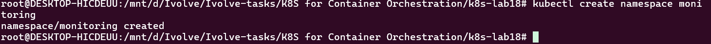
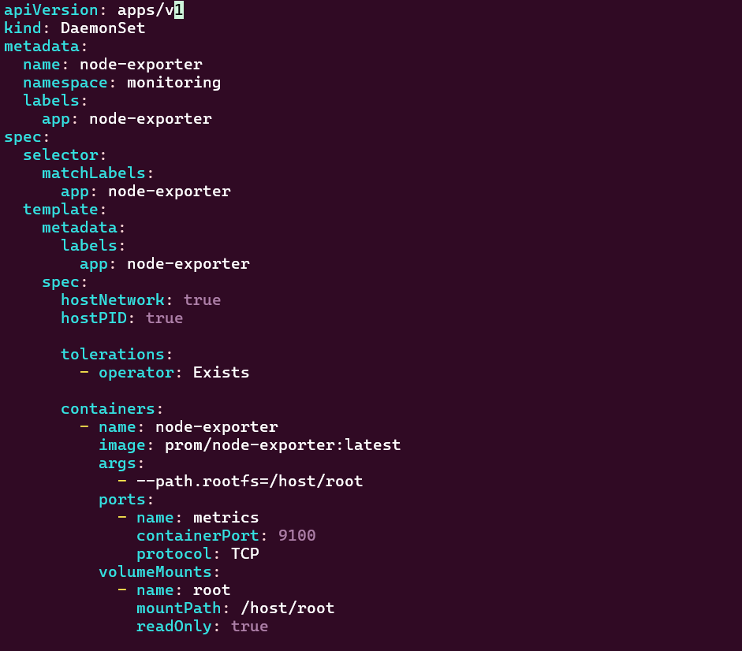
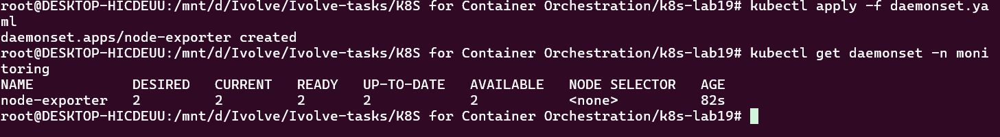
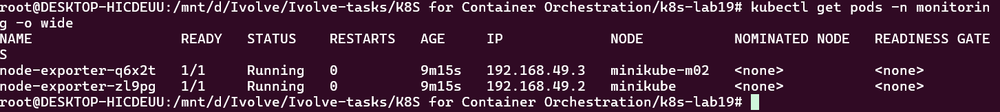
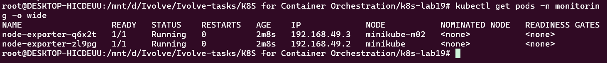
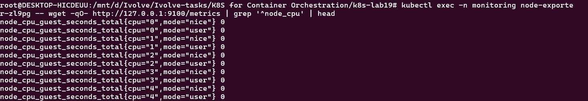

# Lab 19: Node-Wide Pod Management with DaemonSet

## Objective

The objective of this lab is to deploy **Prometheus Node Exporter** as a Kubernetes **DaemonSet**, ensuring that one Node Exporter pod runs on every node in the cluster.

The lab also demonstrates how to:

- Create a dedicated `monitoring` namespace.
- Deploy Node Exporter using a DaemonSet.
- Configure the DaemonSet to tolerate all existing node taints.
- Verify that a Node Exporter pod is running on every node.
- Verify that Node Exporter exposes metrics through port `9100` at `/metrics`.

---

## 1. Create the Monitoring Namespace

A dedicated namespace named `monitoring` was created to organize monitoring-related resources.

Command:

```bash
kubectl create namespace monitoring
```



---

## 2. Create the Node Exporter DaemonSet

The Node Exporter DaemonSet was configured to run one Node Exporter pod on every Kubernetes node.

The configuration includes:

- `prom/node-exporter:latest`
- `hostNetwork: true`
- `hostPID: true`
- Port `9100`
- Toleration for all taints using `operator: Exists`
- Host root filesystem mounted at `/host/root`
- `--path.rootfs=/host/root`

The `Exists` toleration allows the Node Exporter pods to run even if nodes have taints.



---

## 3. Verify the DaemonSet

The DaemonSet was deployed successfully in the `monitoring` namespace.

Command:

```bash
kubectl get daemonset -n monitoring
```



The DaemonSet ensures that the desired number of Node Exporter pods matches the number of Kubernetes nodes.

---

## 4. Verify Pods on Every Node

The following command was used to verify the Node Exporter pods and the nodes on which they are running:

```bash
kubectl get pods -n monitoring -o wide
```



The cluster contains two nodes:

```text
minikube
minikube-m02
```

A Node Exporter pod was successfully scheduled on each node.

---

## 5. Verify One Pod per Node

The Node Exporter pods were verified individually to confirm that each Kubernetes node has its own Node Exporter instance.



This demonstrates the main purpose of a DaemonSet:

```text
Node 1 → Node Exporter
Node 2 → Node Exporter
Node 3 → Node Exporter
...
```

Whenever a new eligible node is added to the cluster, the DaemonSet can automatically schedule a Node Exporter pod on it.

---

## 6. Verify Node Exporter Metrics

Node Exporter exposes Prometheus-compatible metrics through port `9100` and the `/metrics` endpoint.

The endpoint was tested from inside the Node Exporter pod using:

```bash
kubectl exec -n monitoring node-exporter-zl9pg -- \
wget -qO- http://127.0.0.1:9100/metrics
```

The endpoint successfully returned Prometheus metrics.



Examples of exposed metrics include CPU-related metrics such as:

```text
node_cpu_guest_seconds_total
```

This confirms that Node Exporter is successfully collecting and exposing node-level metrics.

---

## 
