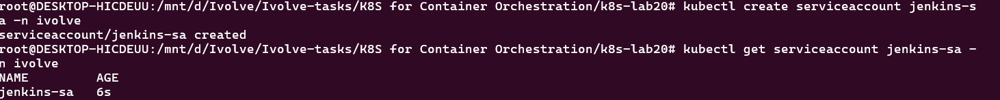
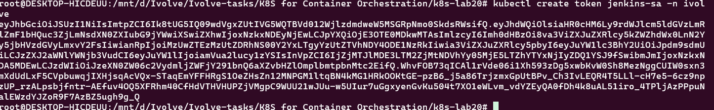
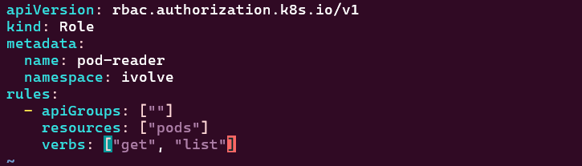
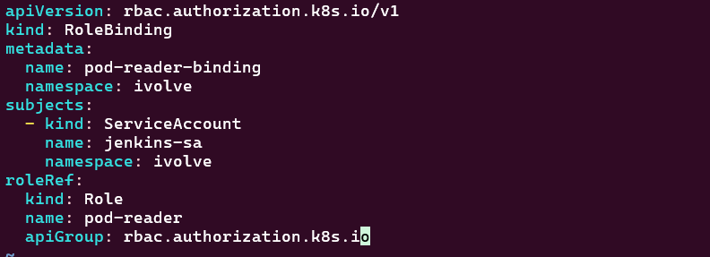
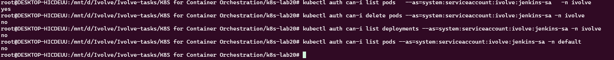
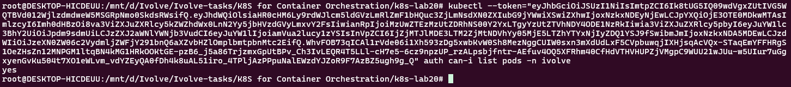

# Lab 20: Securing Kubernetes with RBAC and Service Accounts

## Objective

The objective of this lab is to secure access to Kubernetes resources using **Service Accounts, Roles, and RoleBindings**.

In this lab, a dedicated ServiceAccount named `jenkins-sa` is created in the `ivolve` namespace and granted read-only access to Pods through a Role named `pod-reader`.

The lab demonstrates how Kubernetes RBAC can restrict permissions so that the ServiceAccount can only perform the explicitly allowed actions.

---

## 1. Create the Jenkins ServiceAccount

A ServiceAccount named `jenkins-sa` was created in the `ivolve` namespace.

Command:

```bash
kubectl create serviceaccount jenkins-sa -n ivolve
```



The ServiceAccount can be verified with:

```bash
kubectl get serviceaccount jenkins-sa -n ivolve
```

---

## 2. Create a ServiceAccount Token

A token was generated for the `jenkins-sa` ServiceAccount using:

```bash
kubectl create token jenkins-sa -n ivolve
```



The token can be used to authenticate requests as the `jenkins-sa` ServiceAccount.

> **Note:** The generated token is sensitive authentication information and should not be shared publicly.

---

## 3. Define the `pod-reader` Role

A Role named `pod-reader` was created in the `ivolve` namespace.

The Role grants only two permissions on Pods:

- `get`
- `list`

The Role configuration is stored in:

```text
pod-reader-role.yaml
```

The relevant configuration is:

```yaml
apiVersion: rbac.authorization.k8s.io/v1
kind: Role
metadata:
  name: pod-reader
  namespace: ivolve
rules:
  - apiGroups: [""]
    resources: ["pods"]
    verbs: ["get", "list"]
```



The Role was applied using:

```bash
kubectl apply -f pod-reader-role.yaml
```

---

## 4. Create the RoleBinding

A RoleBinding named `pod-reader-binding` was created to bind the `pod-reader` Role to the `jenkins-sa` ServiceAccount.

The RoleBinding configuration includes:

```yaml
subjects:
  - kind: ServiceAccount
    name: jenkins-sa
    namespace: ivolve

roleRef:
  kind: Role
  name: pod-reader
  apiGroup: rbac.authorization.k8s.io
```



The RoleBinding was applied using:

```bash
kubectl apply -f rolebinding.yaml
```

---

## 5. Validate RBAC Permissions

The permissions assigned to `jenkins-sa` were validated using `kubectl auth can-i`.

### List Pods in `ivolve`

```bash
kubectl auth can-i list pods \
  --as=system:serviceaccount:ivolve:jenkins-sa \
  -n ivolve
```

Result:

```text
yes
```

This confirms that the ServiceAccount can list Pods in the `ivolve` namespace.

### Delete Pods

```bash
kubectl auth can-i delete pods \
  --as=system:serviceaccount:ivolve:jenkins-sa \
  -n ivolve
```

Result:

```text
no
```

The ServiceAccount cannot delete Pods because the `delete` verb was not granted.

### List Deployments

```bash
kubectl auth can-i list deployments \
  --as=system:serviceaccount:ivolve:jenkins-sa \
  -n ivolve
```

Result:

```text
no
```

The ServiceAccount cannot list Deployments because the Role only grants permissions on Pods.

### Access Pods in Another Namespace

```bash
kubectl auth can-i list pods \
  --as=system:serviceaccount:ivolve:jenkins-sa \
  -n default
```

Result:

```text
no
```

This confirms that the Role is namespace-scoped and does not grant access to Pods in the `default` namespace.



---

## 6. Validate the ServiceAccount Token

The generated ServiceAccount token was also used to authenticate requests as `jenkins-sa`.

The token-based authentication was verified against the RBAC permissions.



The results confirm that the ServiceAccount retains only the permissions granted by the `pod-reader` Role.

---

## 7. RBAC Permission Summary

| Resource / Action | Permission |
|---|---|
| List Pods in `ivolve` | ✅ Allowed |
| Get Pods in `ivolve` | ✅ Allowed |
| Delete Pods in `ivolve` | ❌ Denied |
| List Deployments | ❌ Denied |
| List Pods in `default` | ❌ Denied |

---

## RBAC Architecture

```text
                    jenkins-sa
                        │
                        │ RoleBinding
                        ▼
                 pod-reader Role
                        │
              ┌─────────┴─────────┐
              │                   │
           get Pods            list Pods
              │                   │
              └─────────┬─────────┘
                        ▼
                  ivolve namespace

             Everything else → DENIED
```

---

## Conclusion

Lab 20 successfully demonstrated Kubernetes **RBAC and Service Accounts**.

A dedicated `jenkins-sa` ServiceAccount was created and associated with the `pod-reader` Role through a RoleBinding.

The RBAC validation confirmed that the ServiceAccount can:

- List Pods.
- Get Pods.

while it cannot:

- Delete Pods.
- List Deployments.
- Access Pods in other namespaces.

This demonstrates the principle of **least privilege**, where a ServiceAccount receives only the permissions required for its intended purpose.
