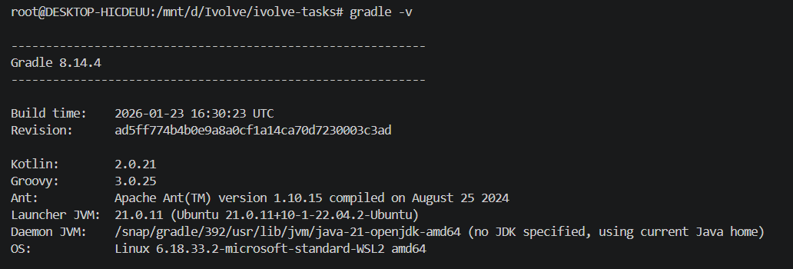
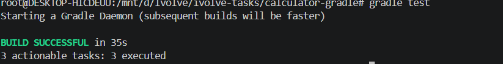
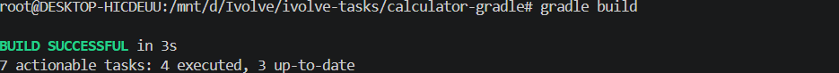
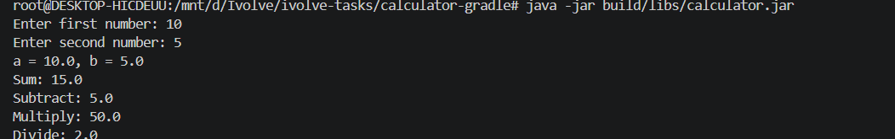

Lab 1: Building and Packaging Java Application with Gradle

Overview

This lab demonstrates how to build, test, package, and run a Java application using **Gradle**.

The application used in this lab is a simple Java Calculator application.

# Lab Steps

## 1. Install Java and Gradle

Update system packages:

```bash
sudo apt update
```

Install Java and Gradle:

```bash
sudo apt install openjdk-17-jdk gradle -y
```

Verify Java installation:

```bash
java -version
```

Verify Gradle installation:

```bash
gradle -v
```

### Screenshot



---

# 2. Clone Source Code

Clone the application source code:

```bash
git clone https://github.com/Ibrahim-Adel15/calculator-gradle.git
```

Navigate to the project directory:

```bash
cd calculator-gradle
```

Check project files:

```bash
ls
```

Expected files:

```
build.gradle
settings.gradle
src/
```

### Screenshot


---

# 3. Run Unit Tests

Execute Gradle unit tests:

```bash
gradle test
```

Test execution result:

```
BUILD SUCCESSFUL
```

All unit tests passed successfully.

### Screenshot



---

# 4. Build Application

Build the Java application:

```bash
gradle build
```

After a successful build, Gradle generates the application artifact.

Check generated artifacts:

```bash
ls build/libs
```

Expected output:

```
calculator.jar
```

Artifact location:

```
build/libs/calculator.jar
```

### Screenshot



---

# 5. Run Application

Run the generated JAR file:

```bash
java -jar build/libs/calculator.jar
```

Example:

```
Enter first number: 10
Enter second number: 5
```

The calculator application runs successfully and performs the required operations.

### Screenshot



---

# Results

The Java Calculator application was successfully:

* Built using Gradle
* Tested using Gradle Unit Tests
* Packaged into a JAR artifact
* Executed successfully

Generated Artifact:

```
build/libs/calculator.jar
```

---

# Project Structure

```
calculator-gradle/
│
├── build.gradle
├── settings.gradle
├── README.md
├── screenshots/
│   ├── gradle-installation.png
│   ├── project-structure.png
│   ├── gradle-test.png
│   ├── gradle-build.png
│   └── application-running.png
│
└── src/
    ├── main/
    └── test/
```
