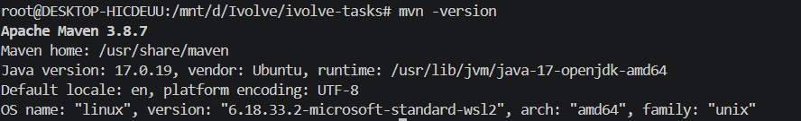
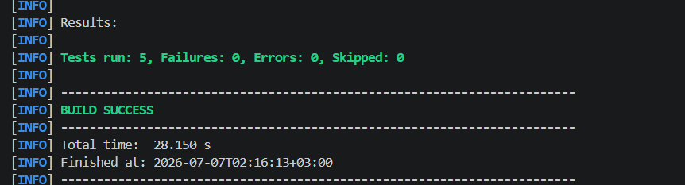
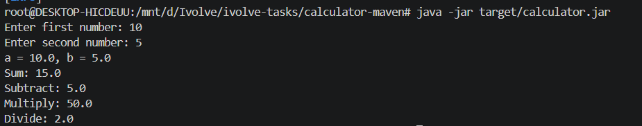

# Lab 2: Building and Packaging Java Application with Maven

## Overview

This lab demonstrates how to build, test, package, and run a Java application using **Apache Maven**.

The application used in this lab is a simple Java Calculator application.

# Lab Steps

1. Install Java and Maven

Update system packages:

```bash
sudo apt update
```
Install Java and Maven:
```
sudo apt install openjdk-17-jdk maven -y
```
Verify Java installation:
```
java -version
```
Verify Maven installation:
```
mvn -version
```
Screenshot




2. Clone Source Code

Clone the Maven calculator application:
```
git clone https://github.com/Ibrahim-Adel15/calculator-maven.git
```
Navigate to the project directory:
```
cd calculator-maven
```
Check project files:
```
ls
```
Expected files:
```
pom.xml
src/
Screenshot
```
3. Run Unit Tests

Execute Maven unit tests:
```
mvn test
```
Test execution expected result:
```
Tests run: 5, Failures: 0, Errors: 0, Skipped: 0

BUILD SUCCESS

All unit tests passed successfully.
```
Screenshot


4. Build Application

Package the Java application:
```
mvn package
```
After a successful build, Maven generates the application artifact.

Check generated files:
```
ls target
```
Expected output:
```
calculator.jar
```
Artifact location:
```
target/calculator.jar
```

5. Run Application

Run the generated JAR file:
```
java -jar target/calculator.jar
```
Example execution:
```
Enter first number: 10
Enter second number: 5
```
The calculator application runs successfully and performs the required operations.

Screenshot



Results

The Java Calculator application was successfully:

 Built using Apache Maven
 Tested using Maven Unit Tests
 Packaged into a JAR artifact
 Executed successfully

Generated Artifact:

target/calculator.jar
Project Structure
calculator-maven/
│
├── pom.xml
├── README.md
├── screenshots/
│   ├── maven-installation.png
│   ├── project-structure.png
│   ├── maven-test.png
│   ├── maven-build.png
│   └── application-running.png
│
└── src/
    ├── main/
    └── test/
