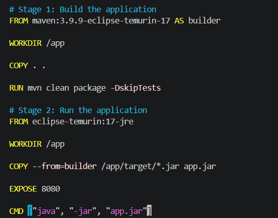
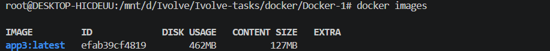
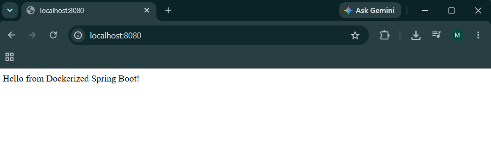

# Lab 5: Multi-Stage Docker Build for Java Spring Boot Application

## Overview

This lab demonstrates how to create a **Multi-Stage Docker Build** for a Java Spring Boot application. The first stage uses Maven to compile and package the application, while the second stage creates a lightweight runtime image containing only the generated JAR file.

Using multi-stage builds helps reduce the final image size and improves security by excluding unnecessary build tools from the production image.

---

## Repository

```bash
git clone https://github.com/Ibrahim-Adel15/Docker-1.git
cd Docker-1
```

---

## Dockerfile

```dockerfile
# Stage 1: Build the application
FROM maven:3.9.9-eclipse-temurin-17 AS builder

WORKDIR /app

COPY . .

RUN mvn clean package -DskipTests

# Stage 2: Create lightweight runtime image
FROM eclipse-temurin:17-jre

WORKDIR /app

COPY --from=builder /app/target/*.jar app.jar

EXPOSE 8080

CMD ["java", "-jar", "app.jar"]
```

---

## Build Docker Image

Build the image using:

```bash
docker build -t app3 .
```

Verify the image:

```bash
docker images
```

---

## Run the Container

Start a container from the image:

```bash
docker run -d --name container3 -p 8080:8080 app3
```

Verify that the container is running:

```bash
docker ps
```
---

## Test the Application

Open your browser and visit:

```
http://localhost:8080
```

Or test using curl:

```bash
curl http://localhost:8080
```

---

## View Container Logs

```bash
docker logs container3
```

---

## Stop and Remove the Container

Stop the running container:

```bash
docker stop container3
```

Remove the container:

```bash
docker rm container3
```

---

## Remove the Docker Image

```bash
docker rmi app3
```

---

## Project Structure

```
Docker-1
├── src/
├── target/
├── pom.xml
├── Dockerfile
└── README.md
```

---

## Benefits of Multi-Stage Builds

* Smaller Docker image size.
* Faster image deployment.
* Reduced attack surface.
* Build dependencies are excluded from the final image.
* Cleaner and production-ready container.

---

## Technologies Used

* Java 17
* Spring Boot
* Maven
* Docker
* Multi-Stage Build

---
