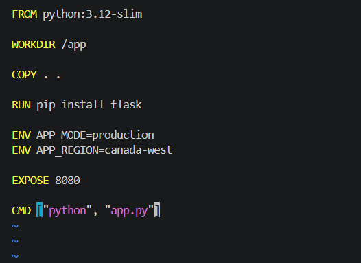
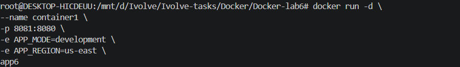
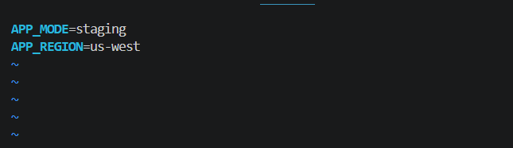
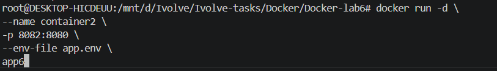
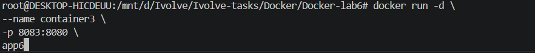
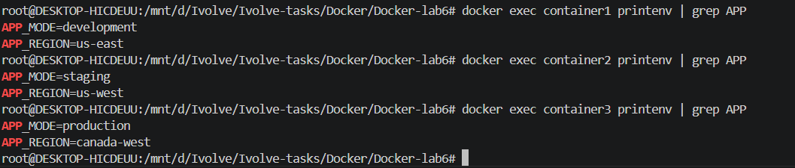
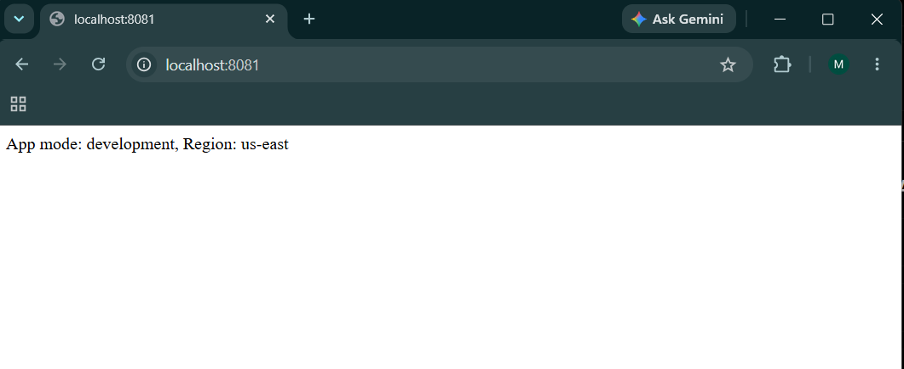
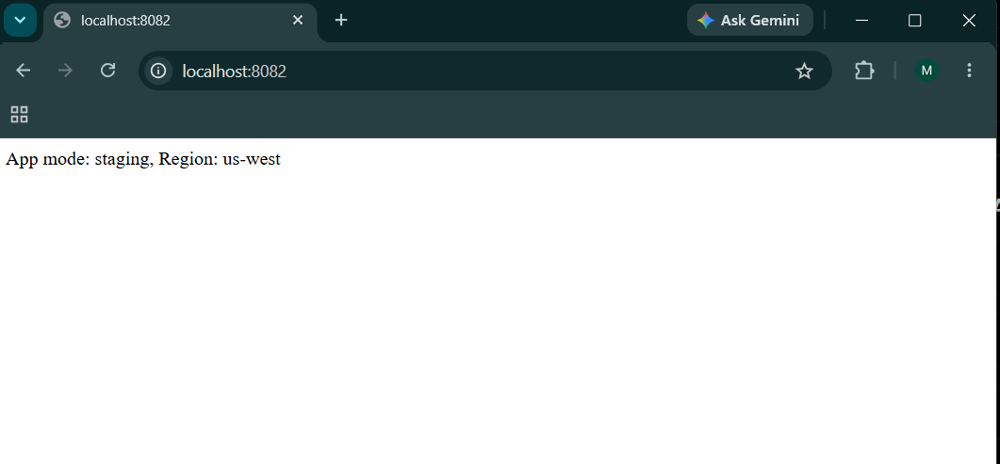
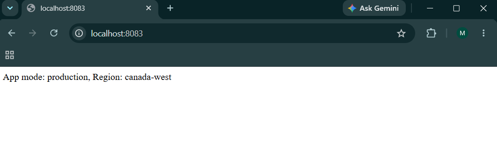

# Lab 6: Managing Docker Environment Variables Across Build and Runtime

## Overview

This lab demonstrates how to manage Docker environment variables using different approaches during container runtime and image build.

Three different methods are used to set environment variables:

1. Passing variables directly using the `docker run` command.
2. Using an environment file (`app.env`).
3. Defining default environment variables inside the Dockerfile.

The application is a simple Flask application running inside a Docker container.

---

## Application Repository

```bash
git clone https://github.com/Ibrahim-Adel15/Docker-3.git

cd Docker-3
```

---

# Dockerfile

The Dockerfile uses a Python base image, installs Flask, exposes port `8080`, defines default environment variables, and runs the Flask application.

```dockerfile
FROM python:3.12-slim

WORKDIR /app

COPY . .

RUN pip install flask

ENV APP_MODE=production
ENV APP_REGION=canada-west

EXPOSE 8080

CMD ["python", "app.py"]
```



---

# Build Docker Image

Build the Docker image:

```bash
docker build -t app6 .
```

---

# Container 1: Environment Variables Using Command Line

Environment variables are passed directly using the `-e` option.

```bash
docker run -d \
--name container1 \
-p 8081:8080 \
-e APP_MODE=development \
-e APP_REGION=us-east \
app6
```



---

# Container 2: Environment Variables Using File

Create an environment file:

`app.env`

```env
APP_MODE=staging
APP_REGION=us-west
```

Run the container using the environment file:

```bash
docker run -d \
--name container2 \
-p 8082:8080 \
--env-file app.env \
app6
```





---

# Container 3: Environment Variables From Dockerfile

The Dockerfile contains default environment variables:

```dockerfile
ENV APP_MODE=production
ENV APP_REGION=canada-west
```

Run the container:

```bash
docker run -d \
--name container3 \
-p 8083:8080 \
app6
```



---

# Verify Environment Variables

Check variables inside each container:

```bash
docker exec container1 printenv | grep APP

docker exec container2 printenv | grep APP

docker exec container3 printenv | grep APP
```

Expected output:

### Container 1

```
APP_MODE=development
APP_REGION=us-east
```

### Container 2

```
APP_MODE=staging
APP_REGION=us-west
```

### Container 3

```
APP_MODE=production
APP_REGION=canada-west
```



---

# Test Application

The Flask application can be accessed through:

### Container 1

```
http://localhost:8081
```



---

### Container 2

```
http://localhost:8082
```



---

### Container 3

```
http://localhost:8083
```



---

# Stop Containers

```bash
docker stop container1 container2 container3
```

---

# Remove Containers

```bash
docker rm container1 container2 container3
```

---

# Remove Image

```bash
docker rmi app6
```

---

# Technologies Used

* Docker
* Python
* Flask
* Docker Environment Variables

