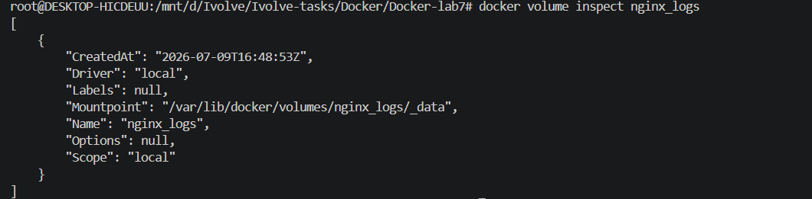
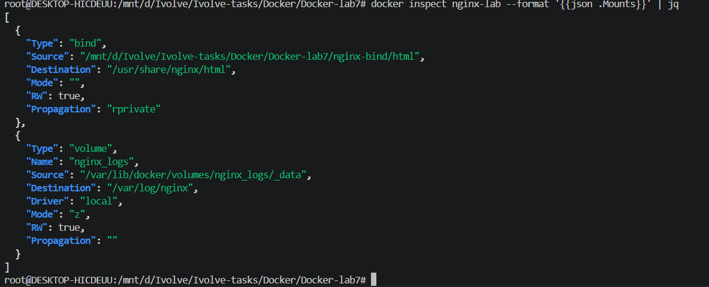
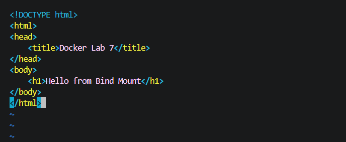
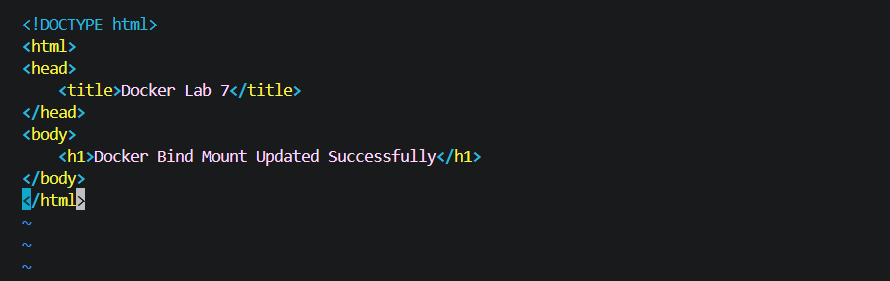
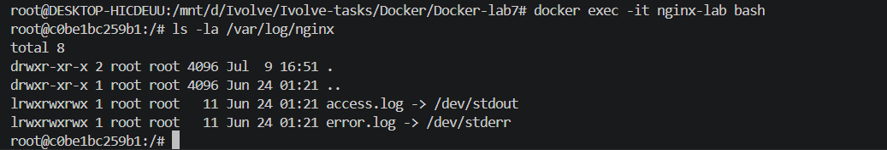
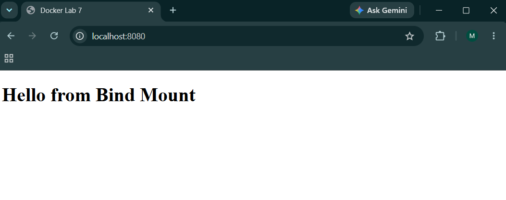
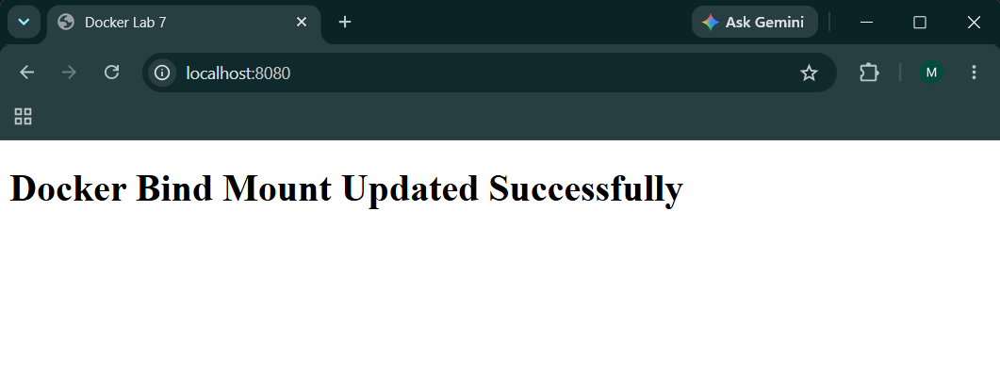

# Lab 7: Docker Volume and Bind Mount with Nginx

## Overview

This lab demonstrates how to use **Docker Volumes** and **Bind Mounts** with an Nginx container.

* **Docker Volume** is used to persist Nginx log files.
* **Bind Mount** is used to serve a custom HTML page directly from the host machine.

---

## Project Structure

```text
Docker-lab7/
├── nginx-bind/
│   └── html/
│       └── index.html
├── screenshots/
│   ├── index-updated.png
│   ├── index.png
│   ├── inspect-container.png
│   ├── inspect.png
│   ├── test1.png
│   ├── test2.png
│   └── verifiy-logs.png
└── README.md
```

---

## Create Docker Volume

```bash
docker volume create nginx_logs
```

Verify the volume:

```bash
docker volume ls
docker volume inspect nginx_logs
```

**Screenshot**



---

## Create Bind Mount Directory

```bash
mkdir -p nginx-bind/html
```

Create `index.html` inside `nginx-bind/html`:

```html
<!DOCTYPE html>
<html>
<head>
    <title>Docker Lab 7</title>
</head>
<body>
    <h1>Hello from Bind Mount</h1>
</body>
</html>
```

---

## Run Nginx Container

```bash
docker run -d \
  --name nginx-lab \
  -p 8080:80 \
  -v nginx_logs:/var/log/nginx \
  -v "$(pwd)/nginx-bind/html:/usr/share/nginx/html" \
  nginx
```

Verify that both the **Volume** and **Bind Mount** are attached:

```bash
docker inspect nginx-lab --format '{{json .Mounts}}' | jq
```

**Screenshot**



---

## Verify the Nginx Page

```bash
curl http://localhost:8080
```

Output:

```text
Hello from Bind Mount
```

**Screenshot**



---

## Update the HTML Page

Edit `nginx-bind/html/index.html` and change the content.

Example:

```html
<h1>Docker Bind Mount Updated Successfully</h1>
```

Verify the updated page:

```bash
curl http://localhost:8080
```

**Screenshot**



---

## Generate Nginx Logs

Generate some HTTP requests:

```bash
curl http://localhost:8080
curl http://localhost:8080
curl http://localhost:8080
```

---

## Verify Docker Volume

Inspect the container mounts:

```bash
docker inspect nginx-lab --format '{{json .Mounts}}' | jq
```

The output confirms that:

* **Bind Mount** → `/usr/share/nginx/html`
* **Docker Volume** → `/var/log/nginx`

**Screenshot**



> **Note:** The latest official Nginx image redirects access and error logs to Docker's standard output (`stdout`/`stderr`) instead of storing them as regular files inside `/var/log/nginx`. The `nginx_logs` volume is successfully mounted to `/var/log/nginx`, as verified by the container inspection.

---

## Testing

### Test 1

Verify the initial page.

**Screenshot**



---

### Test 2

Verify the updated page after modifying `index.html`.

**Screenshot**



---

## Cleanup

Stop and remove the container:

```bash
docker rm -f nginx-lab
```

Remove the Docker volume:

```bash
docker volume rm nginx_logs
```

---

## Technologies Used

* Docker
* Docker Volumes
* Docker Bind Mounts
* Nginx
* Linux (WSL)

