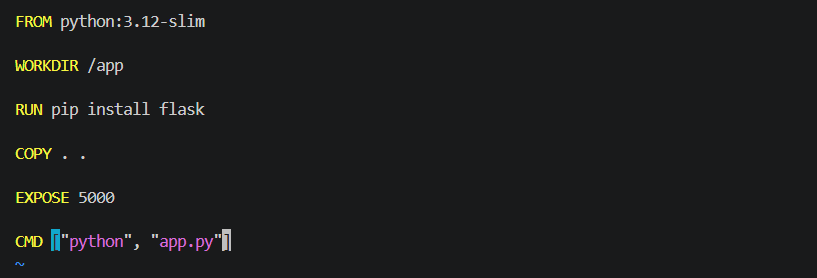
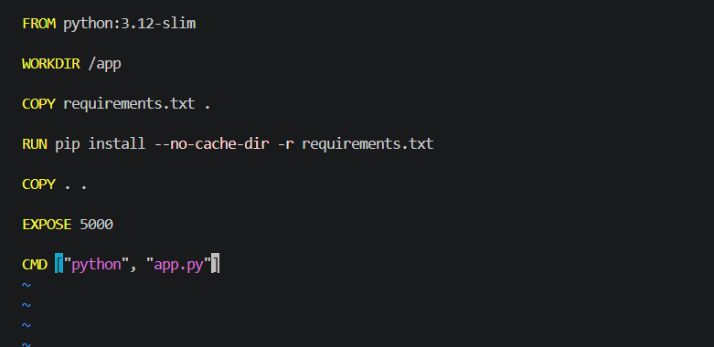
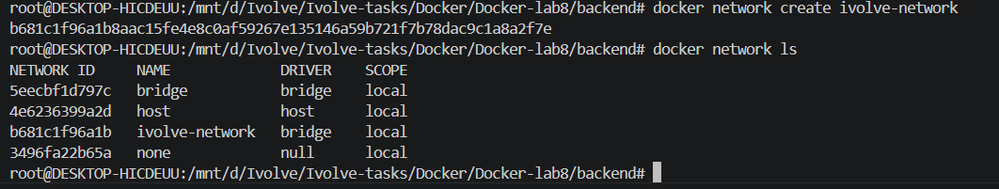
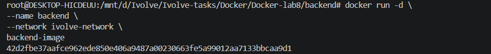
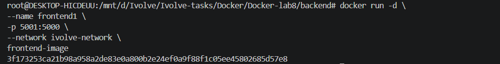
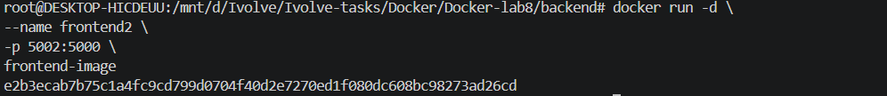
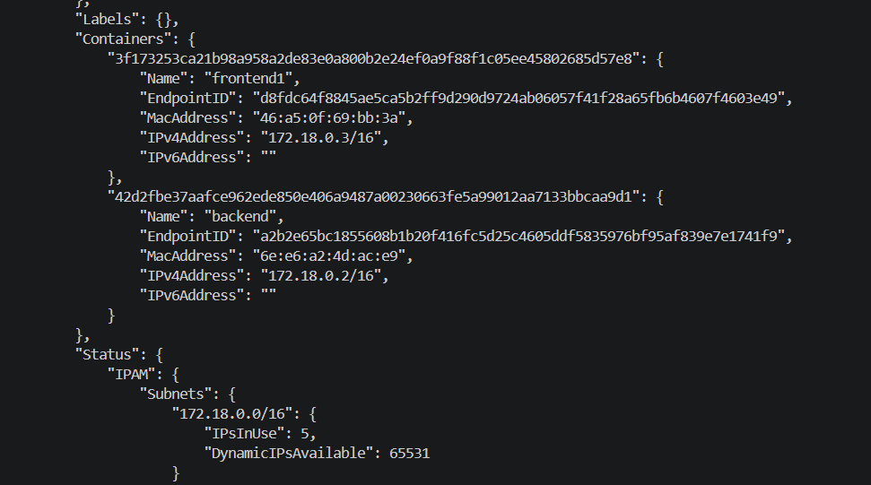
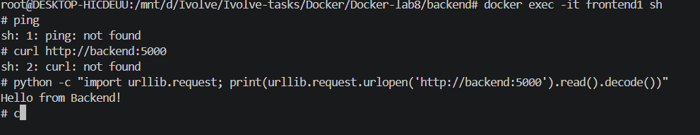
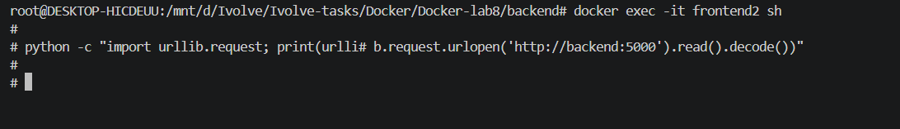

# Lab 8: Custom Docker Network for Microservices

## Overview

In this lab, we built Docker images for two Python microservices (frontend and backend), created a custom Docker network, and demonstrated how containers communicate when connected to the same network. We also verified that containers on different networks cannot communicate directly.

---

## Prerequisites

* Docker installed
* Git installed
* Basic knowledge of Docker images and networks

---

## Project Structure

```text
Docker-lab8
├── backend
│   ├── Dockerfile
│   └── app.py
├── frontend
│   ├── Dockerfile
│   ├── app.py
│   └── requirements.txt
└── screenshots
```

---

## Step 1: Clone the Repository

```bash
git clone https://github.com/Ibrahim-Adel15/Docker5.git
cd Docker5
```

---

## Step 2: Build Docker Images

### Build Backend Image
```bash
FROM python:3.12-slim

WORKDIR /app

RUN pip install flask

COPY . .

EXPOSE 5000

CMD ["python", "app.py"]
```
```bash
cd backend
docker build -t backend-image .
```

Screenshot:



### Build Frontend Image
```bash
FROM python:3.12-slim

WORKDIR /app

COPY requirements.txt .

RUN pip install --no-cache-dir -r requirements.txt

COPY . .

EXPOSE 5000

CMD ["python", "app.py"]
```
```bash
cd ../frontend
docker build -t frontend-image .
```

Screenshot:



---

## Step 3: Create a Custom Network

Create a Docker bridge network named **ivolve-network**.

```bash
docker network create ivolve-network
docker network ls
```

Screenshot:



---

## Step 4: Run the Containers

### Backend

```bash
docker run -d --name backend --network ivolve-network backend-image
```

Screenshot:



### Frontend 1 (Custom Network)

```bash
docker run -d --name frontend1 -p 5001:5000 --network ivolve-network frontend-image
```

Screenshot:



### Frontend 2 (Default Bridge Network)

```bash
docker run -d --name frontend2 -p 5002:5000 frontend-image
```

Screenshot:



---

## Step 5: Inspect the Network

Verify that only **backend** and **frontend1** are attached to the custom network.

```bash
docker network inspect ivolve-network
```

Screenshot:



---

## Step 6: Verify Communication

### Frontend1 → Backend

Since both containers are connected to the same custom network, communication succeeds using the backend container name.

Screenshot:



### Frontend2 → Backend

Since **frontend2** is running on the default bridge network, it cannot communicate with the backend container.

Screenshot:



---

## Cleanup

Stop and remove the containers:

```bash
docker rm -f frontend1 frontend2 backend
```

Remove the custom network:

```bash
docker network rm ivolve-network
```

---

## Key Concepts Learned

* Building Docker images for multiple services.
* Creating custom Docker bridge networks.
* Running containers on specific networks.
* Container-to-container communication using container names.
* Docker DNS-based service discovery.
* Network isolation between different Docker bridge networks.

---

## Technologies Used

* Docker
* Docker Networking
* Python
* Flask
* Git
