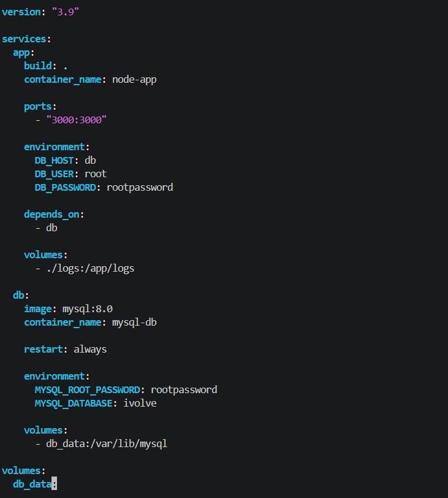
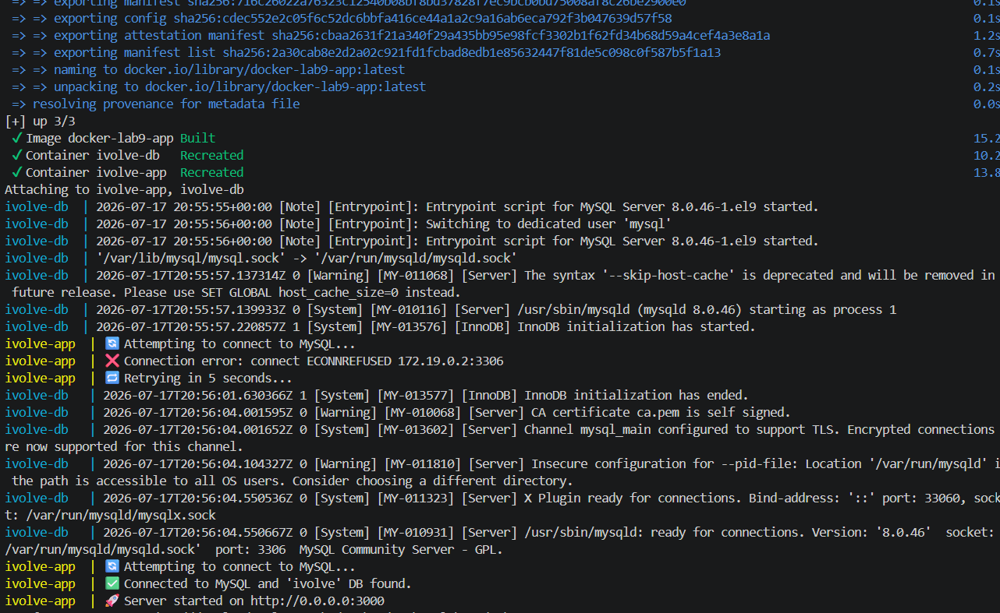
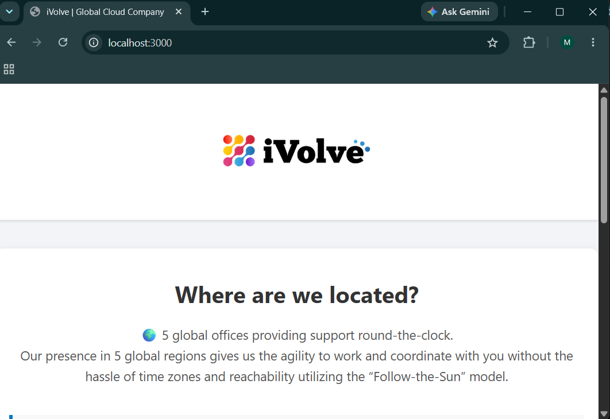
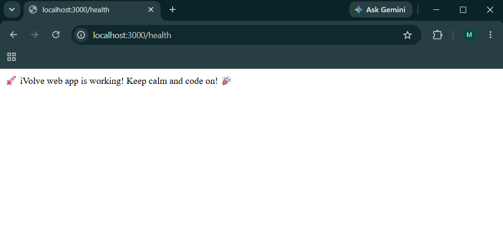
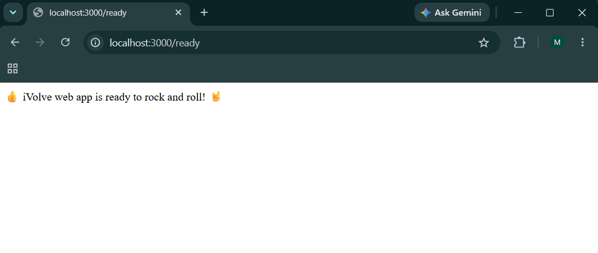
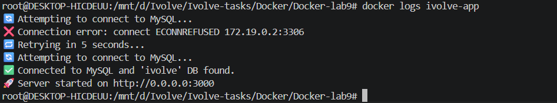
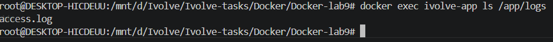
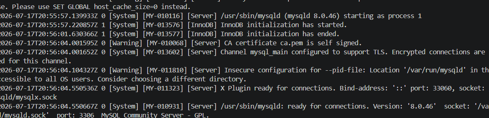
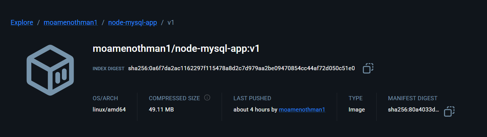

# Lab 9: Containerized Node.js and MySQL Stack Using Docker Compose

##  Project Overview

This project demonstrates how to containerize a Node.js application with a MySQL database using Docker Compose.

The application is built from a local Dockerfile and connected to a MySQL container through a custom Docker network. Environment variables are used to configure database connection settings securely.

---

#  Architecture

The project contains two main services:

## App Service (Node.js)

- Built from local Dockerfile
- Runs on port `3000`
- Connects to MySQL database
- Stores access logs inside `/app/logs`

## Database Service (MySQL)

- Uses MySQL 8.0 official image
- Creates `ivolve` database
- Uses Docker volume for persistent storage


```
                 Docker Network
                       |
        +--------------+--------------+
        |                             |
   Node.js App                  MySQL Database
   Port: 3000                   Port: 3306
        |                             |
   /app/logs                    db_data Volume
```

---

#  Project Structure

```
Docker-lab9
│
├── Dockerfile
├── docker-compose.yml
├── .env
├── db.js
├── server.js
├── package.json
│
├── frontend
│   ├── index.html
│   └── assets
│       └── ivolve-logo.png
│
├── logs
│   └── access.log
│
└── screenshots
    ├── app-verify.png
    ├── docker-compose-op.png
    ├── docker-compose.png
    ├── health-verify.png
    ├── image-repo.png
    ├── logs-app.png
    ├── logs-db.png
    ├── ready-verify.png
    └── verify-access-logs.png
```

---

#  Environment Configuration

The application uses environment variables stored in `.env`:

```env
MYSQL_ROOT_PASSWORD=root123

MYSQL_DATABASE=ivolve

MYSQL_USER=ivolve_user
MYSQL_PASSWORD=ivolve_pass

DB_HOST=db
```

---

#  Docker Compose Configuration

The project uses Docker Compose to manage the Node.js and MySQL containers.

Docker Compose file:




Docker Compose execution:




---

# Running the Application

Build and start containers:

```bash
docker compose up --build
```

Run in detached mode:

```bash
docker compose up -d
```

Check running containers:

```bash
docker ps
```

Application verification:



---

# Health Endpoint Verification

The application provides a health endpoint to verify service availability.

Command:

```bash
curl http://localhost:3000/health
```

Result:



---

# ✅ Readiness Endpoint Verification

The readiness endpoint verifies that the application is ready and connected to the database.

Command:

```bash
curl http://localhost:3000/ready
```

Result:



---

#  Application Access Logs

The application writes access logs inside:

```
/app/logs
```

The logs directory is mounted using Docker bind mount:

```yaml
volumes:
  - ./logs:/app/logs
```

Application logs:




Verify access logs:



---

# MySQL Database Logs

The MySQL container logs were verified successfully:



---

# Database Persistence

The MySQL database uses a Docker named volume:

```
db_data:/var/lib/mysql
```

This ensures that database data remains persistent even after restarting containers.

---

#  Docker Network

The containers communicate through a custom Docker bridge network:

```
ivolve-network
```

The application connects to MySQL using:

```
DB_HOST=db
```

Docker Compose automatically provides internal DNS resolution between services.

---

#  Docker Image Push

The application Docker image was built and pushed to Docker Hub.

Build image:

```bash
docker build -t username/ivolve-app .
```

Login:

```bash
docker login
```

Push:

```bash
docker push username/ivolve-app
```

Docker Hub repository:



---

#  Stopping Containers

Stop services:

```bash
docker compose down
```

Remove containers and volumes:

```bash
docker compose down -v
```

---

# Lab Requirements Completed

✔ Clone application source code  
✔ Create Dockerfile  
✔ Create Docker Compose configuration  
✔ Node.js application container  
✔ MySQL database container  
✔ Environment variables configuration  
✔ Database persistence using volume  
✔ Custom Docker network  
✔ Health endpoint verification  
✔ Readiness endpoint verification  
✔ Application logs verification  
✔ Docker Hub image push  
